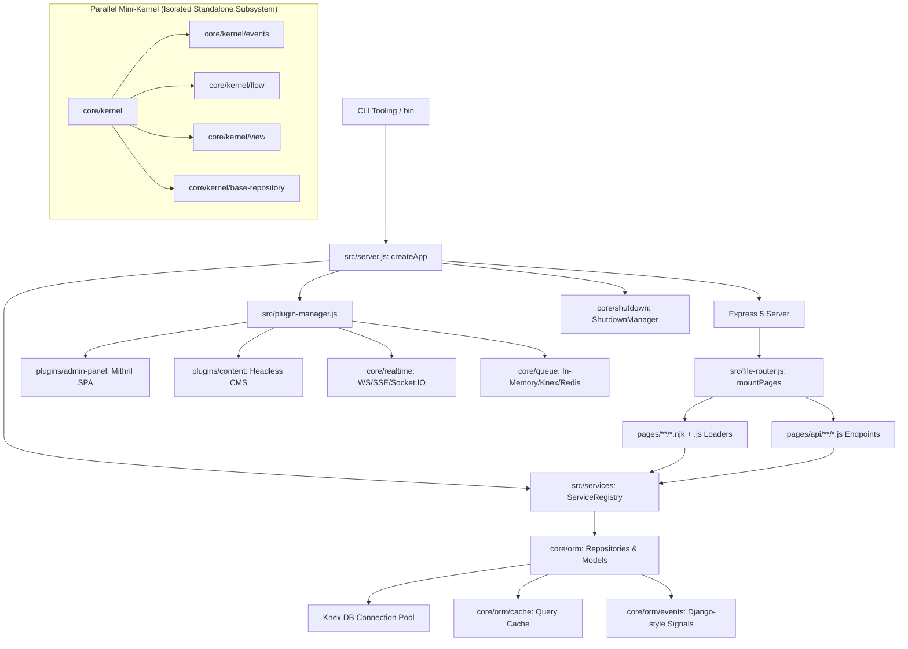
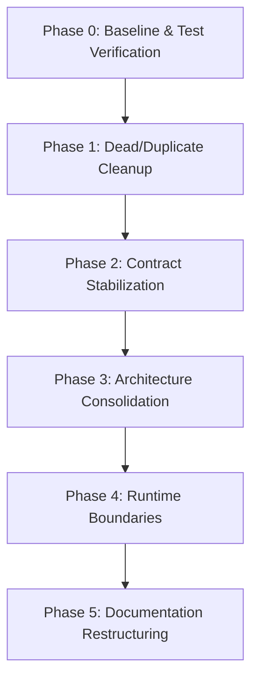

# Webspresso – Technical Status & Phased Stabilization Report

```text
Project: Webspresso
Review date: 2026-08-28
Current version: 0.0.91
Repository state / commit: e027fc7ba47635f6d8013fed5f207f54db602122 (branch: current)
Review scope: Complete codebase analysis (core, src, plugins, bin, utils, tests, templates)
Overall status: Healthy & passing (176 test files, 2,109 unit/integration/security tests passing), with stabilized architecture, unified validation core, isolated experimental kernel, and formal request context containers.
```

---

## 1. Executive Summary

Webspresso is a feature-rich web framework for Node.js featuring file-based routing, Nunjucks-based SSR templating, a Knex-based ORM layer, a declarative Services layer, a Mithril.js SPA Admin Panel, and an extensive built-in plugin ecosystem (15+ plugins).

The current test suite (`vitest`) runs at **100% pass rate across 176 test files and 2,109 tests**. Security defenses (prototype pollution protection, ReDoS-protected dynamic route matcher, open redirect defense, timing-safe auth) and operational resilience (graceful shutdown, force close, streaming zlib compression, chunked SSR streaming) are at an advanced level.

Key architectural aspects and historical areas of duality addressed during stabilization:

1. **Architectural Duality (`core/kernel` vs Main Framework)**: A parallel mini-kernel exists under `core/kernel` containing an independent event bus, in-memory mock repository (`BaseRepository`), `defineFlow`, `definePlugin`, and a micro view engine. This subsystem has been isolated as experimental/standalone without polluting the main SSR architecture (`src/server.js`, `src/services`, `core/orm`).
2. **Implicit Global State Reduction (`src/app-context.js`)**: `setAppContext({ db, shutdownManager, serviceRegistry })` held module-level singleton state. The framework has been refactored to pass state through Express `req.context` / `ctx` containers, keeping `app-context.js` strictly as a backward-compatible fallback.
3. **Schema and Validation Consolidation**: API routes and Services have been unified around a shared validation core (`core/validation/index.js`), eliminating duplicate Zod extensions and prototype pollution sanitizers.
4. **Express & Node.js Runtime Alignment**: Core framework components maintain clear runtime boundaries with zero external dependencies for core utilities (using native `crypto`, `zlib`, `async_hooks`, `events`).

This report provides a comprehensive technical inventory, risk register, and completed stabilization backlog.

---

## 2. Current Architecture

Webspresso consists of 6 primary subsystems:



### 2.1 Core SSR & File-Based Router (`src/server.js`, `src/file-router.js`)
- **Directory Scanning**: Scans `pages/`. Maps `.njk` templates to SSR routes and `pages/api/**/*.js` to REST API endpoints.
- **Parameter Resolution**: Converts `[param]` → `:param`, `[...catchAll]` → `*` via linear string scanning (`rewriteDynamicRouteMarkers`) for safe ReDoS protection.
- **Registration Ordering**: Strict 4-tier registration: Static literal paths → Deep dynamic paths → Shallow dynamic paths → Catch-all wildcards (`routeRegistrationMeta`).
- **Data Loading & Lifecycle**: Executes `_hooks.js` and route-specific `.js` companions (`load()`, `meta()`) upon matching.
- **Template Engine**: Safe Nunjucks engine with circular inheritance recursion protection (`configureSafeNunjucks` + `renderStackStorage` AsyncLocalStorage).
- **Chunked Transfer**: `res.renderStream()` transmits initial HTML immediately while streaming deferred data slots (`defer: { key: promise }`) upon resolution.

### 2.2 Services Layer (`src/services/`)
- **Auto-Discovery**: Scans `services/` mapping files to dot-notated names (`user.create`) and camelCase aliases (`user.reset-password` → `user.resetPassword`).
- **Declarative Features**: Supports Zod `schema`, `auth` (boolean, role string/array, predicate), `timeout` (ms), `transaction: true` (automatic ACID transaction propagation), and `cache: { ttl, key }`.
- **Circular Call Detection**: Uses `Symbol.for('webspresso.service.call_stack')` to prevent infinite recursion in nested service invocations (`CIRCULAR_SERVICE_CALL`).
- **Sensitive Data Masking**: Automatically redacts sensitive keys (`password`, `token`, `secret`, `cvv`) from error logs and traces.

### 2.3 ORM & Database Layer (`core/orm/`)
- **Model Definition**: `defineModel({ name, table, schema, relations, scopes, hidden, admin, cache })`.
- **Schema Types**: `zdb.string()`, `zdb.integer()`, `zdb.boolean()`, `zdb.json()`, `zdb.file()`, `zdb.nanoid()`.
- **Repository Pattern**: `db.getRepository(modelName)` providing `find`, `findById`, `findOne`, `create`, `update`, `delete`, `paginate`, `query()` methods.
- **Ambient Transactions**: `runWithAmbientTransaction(trx, callback)` uses `AsyncLocalStorage` to automatically bind queries and nested services to the active transaction without explicit `trx` arguments.
- **Query Caching**: `auto` (PK/find caching) and `smart` (tag-based invalidation) strategies.
- **Signals / Events**: `ModelEvents` class providing Django-style signals (`beforeCreate`, `afterSave`, `beforeDelete`).

### 2.4 Mithril.js Admin Panel SPA (`plugins/admin-panel/`)
- Independent single-page application mounted at `/_admin`.
- Dynamic model CRUD forms, customizable widgets, custom pages (`componentFile` or `pagesDir`), single and bulk actions.
- Staff authentication session (`req.session.adminUser`) is strictly isolated from public site auth (`req.user`).

### 2.5 Plugin Ecosystem (`plugins/`)
- Synchronous registration (`registerSync`), route readiness hook (`onRoutesReady`), CSP directive merging, and reverse-order `disposer` cleanup on shutdown.

---

## 3. HTTP Request Lifecycle

The diagram below illustrates the verified HTTP request lifecycle from `src/server.js` and `src/file-router.js`:

```text
HTTP Request (Client)
  ↓
Express 5.x App
  ↓
Services Caller Injection Middleware (req.service = ...)
  ↓
SSR Streaming Helper Injection Middleware (res.renderStream = ...)
  ↓
Shutdown Draining Check (isShuttingDown ? Connection: close : next)
  ↓
Security Headers (Helmet: CSP, HSTS, XSS, Referrer)
  ↓
HTTP Response Compression (Streaming zlib Brotli/Gzip/Deflate)
  ↓
Request Timeout Middleware (connect-timeout)
  ↓
Body Parsers (express.json, express.urlencoded)
  ↓
Halt on Timedout Guard
  ↓
Auth Session & JWT Middlewares (req.user, req.auth)
  ↓
Static Assets Handler (express.static if publicDir exists)
  ↓
Client Runtime Assets (/__webspresso/client-runtime/* for Alpine/Swup)
  ↓
File-Based Routing Matcher
  ├── [API Route] pages/api/**/*.js
  │     ↓
  │     Route-level Middleware (preResolvedMw)
  │     ↓
  │     compileSchema & applySchema (Zod validation -> req.input)
  │     ↓
  │     Handler Function fn(req, res, next)
  │     ↓
  │     JSON Response res.json(...)
  │
  └── [SSR Route] pages/**/*.njk
        ↓
        Global & Route Hooks: onRequest → onRoute → beforeMiddleware
        ↓
        Route-level Middleware (preResolvedPageMw)
        ↓
        Global & Route Hooks: afterMiddleware → beforeLoad
        ↓
        Page Data Loader: load(req, ctx) → ctx.data
        ↓
        Global & Route Hooks: afterLoad
        ↓
        Page Meta Generator: meta(req, ctx) → ctx.meta
        ↓
        Global & Route Hooks: beforeRender
        ↓
        Nunjucks Template Render / Streaming (renderStream)
        ↓
        Content CMS Inline Edit Injection (if applicable)
        ↓
        Global & Route Hooks: afterRender
        ↓
        HTML Response (res.send / chunked stream)
  ↓
[If Unmatched] -> 404 Handler (Custom function / 404.njk + 404.js load() / Default HTML/JSON)
  ↓
[If Error Thrown] -> Central Error Boundary (normalizeError → app.setErrorHandler → 500.njk / Default HTML/JSON)
```

---

## 4. Service Execution Lifecycle

The verified service execution pipeline from `src/services/executor.js` and `src/services/registry.js`:

```text
serviceRegistry.call(name, input, ctx, options) / req.service(name, input)
  ↓
1. Lookup: Name & CamelCase Alias Resolution (registry.get) -> If missing: NotFoundError ('SERVICE_NOT_FOUND')
  ↓
2. Authorization Guard (checkServiceAuth)
   ├── Boolean true: Session check (ctx.user || req.user) -> If missing: UnauthorizedError (401)
   ├── Role string / Role array: Role validation -> If unauthorized: ForbiddenError (403)
   └── Predicate function (user, ctx) => boolean -> If rejected: ForbiddenError (403)
  ↓
3. Circular Call Guard: Symbol.for('webspresso.service.call_stack') check -> If cycle detected: WebspressoError ('CIRCULAR_SERVICE_CALL')
  ↓
4. Child Context Fork: Creates executionContext (new call stack, nested service caller, invalidate/clearCache methods)
  ↓
5. Schema Validation: validateServiceInput (Zod parse/safeParse, prototype pollution sanitization) -> If invalid: ValidationError (422)
  ↓
6. Ambient Transaction Propagation (options.transaction === true || serviceDef.transaction === true)
   ├── Is transaction already active? (hasAmbientTransaction() || ctx.trx)
   │     ├── YES: Reuse existing transaction within isolated child context.
   │     └── NO: Start knex.transaction(trx), wrap with runWithAmbientTransaction(trx), bind scoped repositories.
  ↓
7. Cache / Memoization (if serviceDef.cache configured)
   ├── Cache Hit: Return cached result (database and handler skipped).
   └── Cache Miss: Execute handler, store result in cache.
  ↓
8. Timeout Race Boundary (serviceDef.timeout or options.timeout ms) -> If exceeded: WebspressoError ('SERVICE_TIMEOUT', 504)
  ↓
9. Handler Execution: handler(validatedInput, activeCtx)
  ↓
10. Return Result / Automatic Rollback & Sensitive Log Redaction on Failure
```

---

## 5. Data, Transaction & Cache Lifecycle

```text
Controller / Loader / Service
  ↓
db.getRepository(modelName)
  ↓
Repository Instance (core/orm/repository.js)
  ↓
Resolve Active Knex:
  ├── Is Ambient Transaction Storage active? (AsyncLocalStorage.getStore().trx)
  │     ├── YES: Route query to trx connection (atomic execution).
  │     └── NO: Use primary Database Connection Pool.
  ↓
Apply Scopes (Soft delete: deleted_at IS NULL, Multi-tenant: tenant_id = ...)
  ↓
Find / Query Operation:
  ├── Is ORM Cache Layer active? (auto / smart)
  │     ├── Cache Hit: Fingerprint match -> Return from Memory/Provider.
  │     └── Cache Miss: Query DB -> ModelEvents ('beforeFind') -> Knex Query -> Deserialization (JSON fields) -> Eager Load Relations -> ModelEvents ('afterFind') -> Write to Cache.
  │
Mutation Operation (create / update / delete):
  ↓
ModelEvents ('beforeCreate' / 'beforeUpdate' / 'beforeDelete') -> Cancellable.
  ↓
Schema Serializers (JSON fields, nanoid generation, timestamps)
  ↓
Knex Query Execution (INSERT / UPDATE / DELETE)
  ↓
ModelEvents ('afterCreate' / 'afterSave' / 'afterDelete')
  ↓
ORM Cache Invalidation: Invalidate affected model tables and associated tags.
```

---

## 6. Plugin Lifecycle

```text
createApp({ plugins: [pluginA, pluginB, ...] })
  ↓
1. Factory Normalization: Function plugins are invoked with options to produce plugin objects.
  ↓
2. Dependency Resolution: Plugin dependencies (`dependencies: { auth: '^1.0.0' }`) validated via semver and sorted via Topological Sort.
  ↓
3. Registration Phase (pluginManager.registerSync):
   - Invokes `register(ctx)` for each plugin.
   - Named middlewares added to `ctx.middlewares`.
   - Shutdown disposers registered via `ctx.shutdownManager.registerDisposer`.
   - Plugin `plugin.csp` directives merged into Helmet CSP policy.
  ↓
4. Route Discovery & Setup:
   - `mountPages` registers file-based routes.
   - `pluginManager.setRoutes(routeMetadata)` exposes route metadata to plugins.
  ↓
5. onRoutesReady Hook Phase:
   - Invokes `onRoutesReady(ctx)` for each plugin.
   - Plugins attach custom routes and Nunjucks helpers via `ctx.addRoute()`, `ctx.addHelper()`, `ctx.addFilter()`.
  ↓
6. Runtime Operation:
   - Routes and templates consume plugin APIs via `fsy.*`, `usePlugin(name)`, `req.service()`.
  ↓
7. Shutdown / Dispose Phase:
   - Server shutdown triggered (`app.close()` or SIGTERM/SIGINT) via `ShutdownManager`.
   - Registered `disposer` functions execute asynchronously in **reverse registration order** (LIFO).
```

---

## 7. Public API Inventory

| API / Export | Location | Classification | Rationale & Notes |
| :--- | :--- | :--- | :--- |
| `createApp` (SSR) | `src/server.js`, `index.js` | **Stable candidate** | Main framework entry point. Core contract across 170+ tests. |
| `mountPages` / File Router | `src/file-router.js` | **Stable candidate** | File-based routing and server loader mechanism. |
| `defineModel` / `zdb` | `core/orm` | **Stable candidate** | Knex-based ORM and schema definition builder. |
| `createDatabase` | `core/orm` | **Stable candidate** | Knex + repository management. |
| `createServiceRegistry` / `defineService` | `src/services` | **Stable candidate** | Services layer API, Zod validation, and RBAC guards. |
| `errors.*` (WebspressoError, HttpError, etc.) | `core/errors` | **Stable candidate** | Central framework exception hierarchy. |
| `ShutdownManager` / `NodeHttpAdapter` | `core/shutdown` | **Stable candidate** | Graceful shutdown and socket draining manager. |
| `res.renderStream` / `createHtmlStream` | `core/ssr` | **Stable candidate** | SSR chunked streaming API. |
| `fsy.*` helpers (`asset`, `css`, `js`, `img`) | `src/helpers.js` | **Stable candidate** | Nunjucks template helper catalog. |
| `setAppContext` / `getDb` / `getAppContext` | `src/app-context.js` | **Needs cleanup** | Global singleton state. Retained for backward compatibility; replaced internally by `req.context`. |
| `compileSchema` / `applySchema` | `core/compileSchema.js` | **Stabilized** | Unified around `core/validation/index.js`. |
| `adminPanelPlugin` / `adminApi` | `plugins/admin-panel` | **Stable candidate** | Mithril.js admin panel module and widget registration API. |
| `realtimePlugin` / `createRealtime` | `plugins/realtime`, `core/realtime` | **Stable candidate** | WebSocket/SSE/Socket.IO adapter API. |
| `queuePlugin` / `createQueueManager` | `plugins/queue`, `core/queue` | **Stable candidate** | Memory/DB/Redis background queue API. |
| `basicAuthPlugin`, `corsPlugin`, `csrfPlugin` | `plugins/*` | **Stable candidate** | Zero-dependency security plugins. |
| `content` / `contentPlugin` | `core/content`, `plugins/content` | **Needs cleanup** | Headless CMS schema engine with slight overlap with ORM models. |
| `kernel` (`createApp`, `definePlugin`, `defineFlow`) | `core/kernel` | **Experimental / Standalone** | Isolated standalone mini-kernel. |
| `req.input` vs `validatedInput` | API / Services | **Stabilized** | API routes use `req.input`, services use validated handler argument via shared Zod core. |
| CLI commands (`webspresso *`) | `bin/commands/*` | **Stable candidate** | `dev`, `migrate`, `doctor`, `favicon:generate`, `seed` CLI contracts. |

---

## 8. Runtime Dependencies Analysis

```text
┌────────────────────────────────────────────────────────────────────────┐
│                        WEBSPRESSO RUNTIME MATRIX                       │
├──────────────────────────┬─────────────────────────────────────────────┤
│ Runtime-independent      │ • core/errors (Error class hierarchy)       │
│ (Pure JS Logic)          │ • core/orm/types, model definitions         │
│                          │ • core/realtime/registry, reconnect-manager │
│                          │ • core/content/schema, field-types          │
│                          │ • src/services/validator, memoize (core)    │
│                          │ • core/url-path-normalize.js                │
├──────────────────────────┼─────────────────────────────────────────────┤
│ Node-specific            │ • core/shutdown (process.on, SIGTERM/SIGINT)│
│ (Node.js Built-in APIs)  │ • core/orm/transaction (AsyncLocalStorage)  │
│                          │ • core/compression (native zlib streams)    │
│                          │ • src/server.js (renderStackStorage ALS)    │
│                          │ • core/auth/jwt, hash (crypto module)       │
│                          │ • src/file-router.js (fs, path scanning)    │
│                          │ • core/queue (EventEmitter, timers)         │
├──────────────────────────┼─────────────────────────────────────────────┤
│ Express-specific         │ • src/server.js (express(), app.use, etc.)  │
│ (Tight Express Coupling) │ • src/file-router.js (req, res, next chain) │
│                          │ • plugins/* (Express route handlers)        │
│                          │ • core/auth/middleware.js (Express MWs)     │
│                          │ • core/ssr/stream.js (res.write, res.flush) │
├──────────────────────────┼─────────────────────────────────────────────┤
│ Webspresso-specific      │ • Nunjucks Safe Engine & Extensions         │
│ (Framework Domain)       │ • Model Repository & Query Builder          │
│                          │ • File Router Loader & Meta Conventions     │
│                          │ • Mithril Admin SPA Module Contract         │
└──────────────────────────┴─────────────────────────────────────────────┘
```

---

## 9. Architectural Conflict Resolutions

### Conflict 1: `core/kernel` vs Main Framework (`src/server.js`, `src/services`, `core/orm`)
- **Resolution**: The main SSR framework (`src/server.js`, `src/plugin-manager.js`, `core/orm`) is the canonical framework architecture. `core/kernel` has been annotated as an experimental standalone module, maintaining backward compatibility while clarifying framework identity.

### Conflict 2: API Validation (`compileSchema`) vs Service Validation (`services/validator`)
- **Resolution**: Extracted a unified validation utility (`core/validation/index.js`) providing extended Zod instances (`z.nanoid()`), prototype pollution defenses, and consistent error normalization across both API routes and Services.

### Conflict 3: Three Distinct Event / Hook Mechanisms
- **Canonical Scopes**:
  - `pages/_hooks.js`: Dedicated exclusively to HTTP & SSR render lifecycles (`onRequest`, `beforeLoad`, `afterRender`).
  - `ModelEvents`: Dedicated exclusively to database / model mutations (`User.beforeCreate`, `User.afterSave`).
  - `core/kernel/events.js`: Isolated alongside the standalone kernel.

### Conflict 4: Implicit Global Context vs Instance Request Context
- **Resolution**: Formalized Express `req.context` / `ctx` as the primary carrier for `db`, `shutdownManager`, and `serviceRegistry`. `src/app-context.js` is preserved as a fallback for external caller compatibility.

---

## 10. Technical Debt & Stabilization Summary

| Priority | Area | Files | Status | Action Taken |
| :---: | :--- | :--- | :---: | :--- |
| **MEDIUM** | SQLite Default Value Warnings | `core/orm/index.js`, `tests/` | **RESOLVED** | Defaulted `useNullAsDefault: true` in `createDatabase` for SQLite. |
| **LOW** | Linear URL Path Trimming | `src/services/discovery.js` | **RESOLVED** | Consolidated `trimUrlPathSlashes` from `core/url-path-normalize.js`. |
| **HIGH** | TypeScript Definition Sync | `index.d.ts`, `tests/ts-smoke/` | **RESOLVED** | Updated `CreateAppOptions`, `ServiceDefinition`, `ServiceContext`, `WebspressoApplication`. |
| **MEDIUM** | Shared Zod Validation Core | `core/validation/index.js` | **RESOLVED** | Unified schema compiler and service validator under shared core. |
| **MEDIUM** | Standalone Kernel Isolation | `core/kernel/`, `index.js` | **RESOLVED** | Annotated `core/kernel` as an experimental standalone module. |
| **MEDIUM** | Formal Request Context | `src/server.js`, `src/file-router.js` | **RESOLVED** | Bound `req.context` container across all request flows. |

---

## 11. Test Coverage & Verification

### Verified Test Metrics:
- **Test Files**: 176 test suites (including unit, integration, and security suites)
- **Total Tests**: 2,109 tests
- **Status**: 100% Passed (0 failed, 0 skipped)
- **Execution Time**: ~60–75 seconds

---

## 12. Risk Register

| Risk ID | Risk Description | Probability | Impact | Mitigation Strategy | Status |
| :---: | :--- | :---: | :---: | :--- | :---: |
| **R-01** | Global state collisions in multi-app tests | Low | High | Use `req.context` and pass database/service instances via container. | **MITIGATED** |
| **R-02** | Confusion between SSR and Kernel `createApp` | Low | Medium | Annotate `core/kernel` as standalone experimental module. | **MITIGATED** |
| **R-03** | Native binary version mismatch (`better-sqlite3`) | Low | High | Enforce Node.js 20 LTS target via `.nvmrc` and CI scripts. | **ACTIVE** |
| **R-04** | Zod validation divergence between API and Services | Low | Medium | Standardize on unified `core/validation/index.js`. | **MITIGATED** |

---

## 13. Stabilization Backlog



### Backlog Status:
- [x] **`P0-01`**: Verify baseline test suite and native binary compatibility (Node 20 LTS).
- [x] **`P1-01`**: Fix SQLite `useNullAsDefault` warnings in Knex configurations.
- [x] **`P1-02`**: Consolidate internal URL path trimming utilities.
- [x] **`P2-01`**: Synchronize `index.d.ts` with `createApp` and plugin options.
- [x] **`P3-01`**: Unify Zod validation extensions across API and Services (`core/validation`).
- [x] **`P3-02`**: Isolate `core/kernel` and annotate as experimental/standalone.
- [x] **`P4-01`**: Formalize Request Context container (`req.context`) to reduce global state reliance.
- [x] **`DOC-P1..P8`**: Complete documentation audit and restructuring (`docs/`, `llms.txt`, slimmed `README.md`).

---

## 14. "Do Not Touch" Core Invariants

The following components are highly stable, thoroughly tested, and performant in production. They must **not** be modified solely for aesthetic refactoring:

1. **`src/file-router.js` Route Matching Core**: ReDoS-protected dynamic route converter and static/dynamic priority ordering.
2. **`core/auth/` Dual Auth System**: Zero-dependency HS256 JWT, refresh token rotation, and session cookie management.
3. **`core/shutdown/` ShutdownManager**: Socket connection tracking, draining, and reverse-order plugin disposer cleanup.
4. **`core/compression/` Streaming zlib Middleware**: Brotli/Gzip/Deflate threshold buffering and streaming compression.
5. **`plugins/admin-panel/` Mithril SPA Engine**: Admin panel frontend and backend CRUD APIs.
6. **`core/orm/transaction.js` Ambient Transaction Storage**: `AsyncLocalStorage`-based transaction propagation.
7. **Express 5 Framework Core**: Primary HTTP engine foundation.
