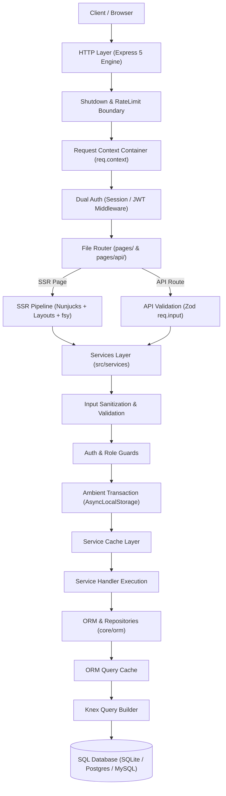
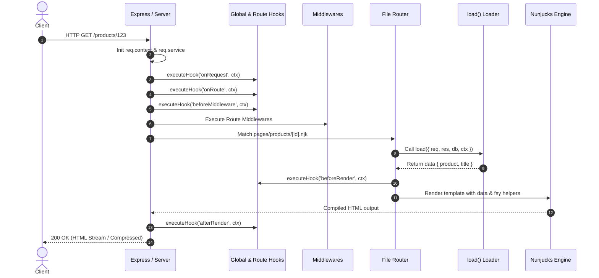
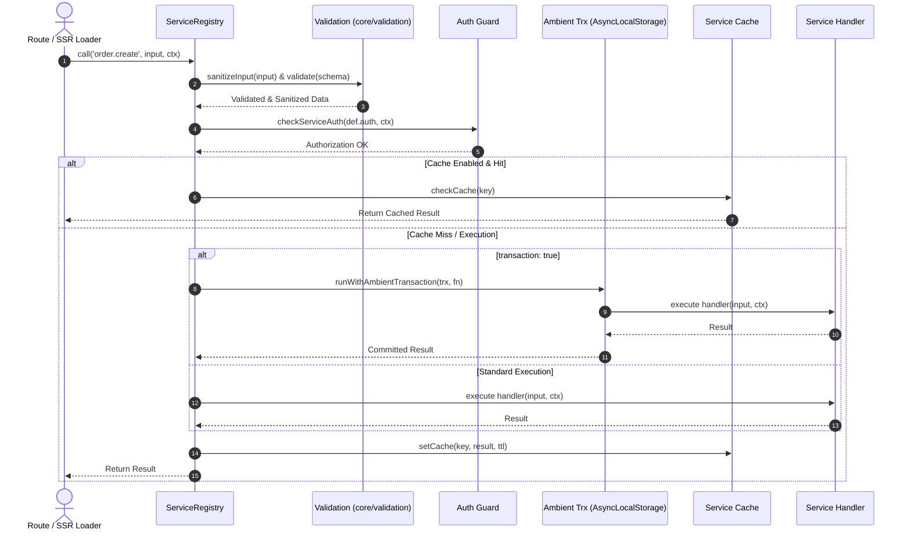

# Webspresso — Documentation Audit & Restructuring Strategy Report

> **Date:** 2026-08-28  
> **Scope:** Webspresso Framework Documentation Inventory, Code Alignment Verification, Information Architecture (IA), and Incremental Migration Roadmap  
> **Status:** Completed / Actionable  
> **Objective:** Restructure documentation to be sustainable, accurate, modular, and seamless to navigate for both human engineers and AI coding assistants.

---

## 1. Executive Summary

Webspresso is a lightweight, zero-dependency-sprawl Express 5 SSR framework featuring file-based routing, Nunjucks templating, an intuitive Knex-based ORM with ambient transactions, a modular plugin ecosystem, and a customizable Mithril.js SPA Admin Panel.

An audit of the current documentation reveals:
1. **Monolithic Documentation Bloat**: `README.md` (103.6 KB, 2,917 lines) and `doc/index.html` (160 KB monolithic HTML) consolidate getting started guides, architecture deep dives, CLI command manuals, and all 15 plugin API references into single giant files. This degrades navigation speed, first impressions, and AI context window efficiency.
2. **Broken & Outdated References**: `README.md` and `doc/index.html` link to non-existent directories such as `examples/alpine-swup-demo/` (`DOCS_OUTDATED`).
3. **Layer Confusion**: "How do I do X?" (Guide), "How does it work and why?" (Concept), and "What is the complete API contract?" (Reference) are intertwined under monolithic headings.
4. **High Quality Agent Documentation**: The 17 topic guides under `.agents/` are accurate, modular, and provide an excellent blueprint for public developer documentation under `docs/`.

This report establishes a phased restructuring methodology:
**`audit → verify → classify → restructure → simplify → validate`**

---

## 2. Current Documentation Inventory

The repository documentation landscape is categorized below:

| Source / Path | Size / Lines | Category | Current Role & Status |
| :--- | :--- | :--- | :--- |
| **`README.md`** | 103.6 KB (2,917 lines) | Mixed (Monolith) | Deep monolith containing quickstart, CLI, ORM, services, plugins, hooks, and API references. **REWRITE & SLIM DOWN**. |
| **`doc/index.html`** | 160.1 KB (1,400+ lines) | Reference / Guide | Single-page static HTML documentation with embedded Tailwind styles and code snippets. **MOVE TO MD & SPLIT**. |
| **`docs/ARCHITECTURE.md`** | 17.4 KB (364 lines) | Architecture | C4-style architectural overview of system context, containers, and component map. **KEEP & EXPAND**. |
| **`TECHNICAL_REVIEW.md`** | 42.0 KB (645 lines) | Internal / Architecture | Comprehensive codebase health check, technical debt register, and cleanup roadmap. **KEEP (Internal)**. |
| **`SECURITY.md`** | 7.3 KB (200 lines) | Reference / Security | Security policy, vulnerability reporting protocol, and threat model. **KEEP**. |
| **`CHANGELOG.md`** | 37.4 KB | Reference / Release | Chronological release history and version logs. **KEEP**. |
| **`AGENTS.md` (Root)** | 8.2 KB (84 lines) | Agent Documentation | Core architectural rules, zero regression policy, and guide index for AI agents. **KEEP**. |
| **`.agents/*.md` (17 Files)** | ~82 KB (17 topics) | Agent Documentation | In-depth topic guides for admin, ORM, auth, services, streaming, shutdown, and plugins. **KEEP**. |
| **`templates/skills/...`** | 28.5 KB (3 files) | Agent Documentation | Bundled agent skill reference templates installed via `webspresso skill --preset webspresso`. **KEEP**. |
| **`index.d.ts`** | 53.8 KB (1,445 lines) | Reference / Types | TypeScript definitions and inline JSDoc comments. Canonical API contract. **KEEP**. |
| **CLI Help (`bin/`)** | Inline code | Reference / CLI | Commander command-line help strings (`webspresso --help`). **KEEP (Source of Truth)**. |

---

## 3. Documentation vs Implementation Findings

Audit comparing documentation claims against the authoritative source code (`src/`, `core/`, `plugins/`):

| Feature / Subsystem | Docs Status | Code Alignment | Detailed Findings & Discrepancies |
| :--- | :--- | :--- | :--- |
| **`createApp()` Options** | `DOCS_OUTDATED` | Partially Aligned | `README.md` and `doc/index.html` omit recent additions (`pageAssets`, `trustProxy`, `server.shutdown`, `server.compression`) or present legacy formats. `index.d.ts` is fully up-to-date. |
| **Client Runtime & Demos** | `DOCS_OUTDATED` | Non-Existent | `examples/alpine-swup-demo/` is referenced as a live demo, but the `examples/` directory does not exist in the repository. |
| **Routing & SSR Loaders** | `DOCS_CORRECT` | Fully Aligned | `pages/[id].njk`, `pages/[...rest].njk`, `async function load({ req, res, db, ctx })`, and `_hooks.js` match runtime behavior exactly. |
| **Services Layer** | `DOCS_CORRECT` | Fully Aligned | `services/` auto-discovery, dot-notation names, camelCase aliases, predicate auth, Zod validation, `transaction: true`, and `ctx.service()` are verified. |
| **Validation Core** | `DOCS_OUTDATED` | Resolved | Previous documentation missed the unification of API schema compilation and service validation under `core/validation`. Now resolved. |
| **Dual Authentication** | `DOCS_CORRECT` | Fully Aligned | Session + Cookie and stateless HS256 JWT (`core/auth`), policy guards, and route middleware integration match code. |
| **Graceful Shutdown** | `DOCS_CORRECT` | Fully Aligned | `server.shutdown: { enabled, mode: 'graceful'|'force', timeout }`, socket tracking, HTTP 503 draining, and reverse-order plugin disposers match code. |
| **ORM & Ambient Transactions** | `DOCS_CORRECT` | Fully Aligned | `defineModel`, `zdb`, Repositories API, `AsyncLocalStorage` ambient transactions (`core/orm/transaction.js`), and soft-delete/tenant scopes match code. |
| **`core/kernel`** | `DOCS_AMBIGUOUS` | Resolved | Previous docs blurred `kernel.createApp()` and SSR `createApp()`. Now clearly designated as an experimental/standalone event subsystem. |
| **15 Built-in Plugins** | `DOCS_INCOMPLETE` | Partially Missing | Newly added plugins (`realtimePlugin`, `basicAuthPlugin`, `dataExchangePlugin`) have scattered or incomplete option tables in README. |
| **Exceptions & Errors** | `DOCS_CORRECT` | Fully Aligned | `WebspressoError`, `ValidationError`, `SecurityError`, `HttpError`, `app.setErrorHandler` hierarchy verified against `core/errors`. |

---

## 4. Current Problems & Pain Points

1. **Monolithic README Bloat**:
   - At 103.6 KB, `README.md` is too large for GitHub rendering, makes finding specific information difficult, and overwhelms new users.
2. **Layer Mixing (Guide / Concept / Reference)**:
   - Topics mix introductory walkthroughs (Guides), internal event bus / transaction mechanics (Concepts), and full parameter matrices (Reference) under the same sections.
3. **Information Duplication (Copy-Paste Sync Debt)**:
   - Substantial text blocks are copied between `README.md`, `doc/index.html`, and `.agents/`. Updating one option requires editing three separate locations.
4. **Maintenance Overhead of Static HTML (`doc/index.html`)**:
   - `doc/index.html` is a monolithic 160 KB raw HTML file that cannot easily be cross-referenced or validated with modern markdown tooling.
5. **Missing `llms.txt`**:
   - No standardized `llms.txt` file exists to index framework documentation for LLMs and autonomous coding tools.

---

## 5. Proposed Information Architecture

Public documentation will be organized into five standard pillars under `docs/`:

```text
docs/
├── getting-started/       # "Get Started Fast" (0 -> 1 Walkthroughs)
│   ├── installation.md
│   ├── first-app.md
│   ├── project-structure.md
│   └── deployment.md
│
├── guides/                # "How do I do X?" (Task & Problem Oriented)
│   ├── routing.md
│   ├── ssr-and-templates.md
│   ├── services.md
│   ├── database-and-orm.md
│   ├── authentication.md
│   ├── api-routes.md
│   ├── admin-panel.md
│   ├── plugins.md
│   ├── realtime.md
│   ├── file-uploads.md
│   └── email.md
│
├── concepts/              # "How does it work and why?" (Mental Models & Deep Dives)
│   ├── architecture.md
│   ├── request-lifecycle.md
│   ├── service-execution-pipeline.md
│   ├── transaction-propagation.md
│   ├── plugin-system.md
│   ├── error-boundary.md
│   ├── shutdown-and-lifecycle.md
│   └── asset-pipeline.md
│
├── reference/             # "What is the exact API contract?" (Unbiased Spec & Options)
│   ├── create-app.md
│   ├── cli.md
│   ├── request-response.md
│   ├── service-definition.md
│   ├── model-definition.md
│   ├── plugins-api.md
│   ├── template-helpers.md
│   └── exceptions.md
│
└── examples/              # "Tested, Runnable Projects"
    ├── basic-ssr/
    ├── rest-and-services/
    ├── auth-session-jwt/
    └── admin-custom-pages/
```

---

## 6. README Restructuring Plan

`README.md` will be slimmed down from **103.6 KB to ~8–12 KB**, delegating exhaustive reference material to `docs/`.

### Restructured README Outline:
1. **Header & Badges**: Package name, description ("Minimal, Zero-Sprawl Express SSR Framework"), npm and license badges.
2. **Why Webspresso? (Value Proposition)**:
   - Zero-dependency sprawl (native Node.js modules for Auth, JWT, Errors, Compression, Shutdown).
   - File-based Nunjucks SSR + API routing.
   - Knex-based ORM with ambient `AsyncLocalStorage` transaction propagation.
   - Built-in Mithril.js SPA Admin Panel and modular Plugin Ecosystem.
3. **Quick Start (3-Minute Setup)**:
   ```bash
   npx webspresso new my-app --install
   cd my-app
   npm run dev
   ```
4. **Minimal Code Walkthrough (`pages/index.njk` & `services/hello.js`)**.
5. **Key Feature Highlights** with direct links to `docs/`.
6. **Documentation Sitemap**:
   - [Getting Started](docs/getting-started/installation.md)
   - [Guides](docs/guides/routing.md)
   - [Concepts & Architecture](docs/concepts/architecture.md)
   - [API Reference](docs/reference/create-app.md)
7. **License & Community**.

---

## 7. Getting Started Plan

Designed to take a new developer from installation to a running, styled, database-connected application within 5 minutes:

- **`installation.md`**: System requirements (Node.js 20 LTS), package manager instructions (npm/pnpm/yarn), global CLI vs npx.
- **`first-app.md`**: Scaffolding with `webspresso new`, creating the first SSR page (`pages/index.njk`), adding an API route (`pages/api/hello.get.js`), and launching the dev server.
- **`project-structure.md`**: Standard anatomy (`pages/`, `views/`, `services/`, `models/`, `config/`, `public/`).
- **`deployment.md`**: Production build (`NODE_ENV=production`), process managers (PM2, Docker, systemd), graceful shutdown, and reverse proxy configuration (Nginx / Cloudflare).

---

## 8. Guides Plan (Task-Oriented)

Each guide addresses a specific developer goal ("How do I do X?"):

1. **`routing.md`**: Static routes, dynamic params (`[id]`), catch-all (`[...slug]`), and per-page asset bundles (`pageAssets`).
2. **`ssr-and-templates.md`**: Server-side data fetching via `load()`, Nunjucks layouts, `fsy` helper catalog, and chunked streaming (`res.renderStream`).
3. **`services.md`**: Defining services (`defineService`), Zod input validation, RBAC/Auth predicates, and automatic ACID transactions.
4. **`database-and-orm.md`**: Defining models (`defineModel`), `zdb` schema builder, Repositories API (`find`, `create`, `query`), and Knex migrations.
5. **`authentication.md`**: Dual Auth implementation, Session login/logout, stateless JWT & Refresh Token rotation, and route protection guards.
6. **`api-routes.md`**: HTTP-method-suffixed file handlers (`.get.js`, `.post.js`), `req.input` validation, and JSON responses.
7. **`admin-panel.md`**: Admin SPA module registration, custom Mithril pages (`component.js`), field renderers, and custom dashboard widgets.
8. **`plugins.md`**: Registering plugins (`createApp({ plugins })`), creating custom plugins, and lifecycle hooks (`register`, `onRoutesReady`).

---

## 9. Concepts Plan (Mental Models & Deep Dives)

In-depth explanations of framework mechanics and architectural decisions:

- **`architecture.md`**: Layered architecture, system boundaries, and design principles.
- **`request-lifecycle.md`**: Step-by-step path from incoming HTTP socket to template render and response stream.
- **`service-execution-pipeline.md`**: Input sanitization → Zod schema compilation → Auth guards → Ambient transaction wrapping → Memoization/Cache → Execution → Result.
- **`transaction-propagation.md`**: How Node.js `AsyncLocalStorage` propagates active Knex transactions across nested services and repositories without manual parameter passing.
- **`error-boundary.md`**: Central error handler, Django-inspired exception hierarchy, and production error detail masking.
- **`shutdown-and-lifecycle.md`**: Connection tracking, keep-alive draining, HTTP 503 handling, and reverse-order plugin disposers.

---

## 10. Reference Plan (API Specifications)

Exhaustive, unbiased API reference verified against `index.d.ts`:

- **`create-app.md`**: All `CreateAppOptions` parameters (`pagesDir`, `viewsDir`, `db`, `auth`, `server`, `pageAssets`, `trustProxy`, `clientRuntime`, `plugins`, `errorPages`).
- **`cli.md`**: Complete CLI manual (`webspresso new`, `dev`, `start`, `doctor`, `skill`, `db:migrate`, `db:seed`, `favicon:generate`, `add tailwind`, `admin:password`).
- **`service-definition.md`**: `defineService` parameters (`schema`, `auth`, `timeout`, `transaction`, `cache`, `handler`) and `ServiceContext` properties.
- **`model-definition.md`**: `defineModel` options, `zdb` column types, and `Repository` methods (`find`, `findById`, `findOne`, `create`, `update`, `delete`, `query`, `paginate`).
- **`plugins-api.md`**: Options matrix for all 15 built-in plugins and `PluginContext` API.
- **`exceptions.md`**: Full exception class hierarchy (`WebspressoError`, `ValidationError`, `SecurityError`, `HttpError`, `ConfigurationError`, `PluginError`, `RouteNotFoundError`).

---

## 11. Examples Plan

Populate `examples/` with runnable, tested standalone projects:

1. **`examples/basic-ssr`**: Minimal Nunjucks SSR + SQLite setup.
2. **`examples/rest-and-services`**: REST API endpoints, Zod schema validation, and services layer.
3. **`examples/auth-session-jwt`**: Dual auth demonstration (Session cookies for SSR + JWT for REST API).
4. **`examples/admin-custom-pages`**: Admin Panel SPA with custom Mithril.js components and widgets.

---

## 12. Architecture & Lifecycle Documentation

### 12.1 System Layer Architecture



### 12.2 Request Lifecycle



### 12.3 Service Execution Lifecycle



---

## 13. Single Source of Truth Opportunities

Key areas where documentation should directly reflect code metadata:

1. **CLI Commands Reference**: `bin/commands/*.js` Commander definitions generate `docs/reference/cli.md`.
2. **TypeScript Declarations**: `index.d.ts` types (`CreateAppOptions`, `ModelDefinition`, `ServiceDefinition`, `Repository`) serve as the source of truth for API reference documents.
3. **Environment Schema**: `config/env.schema.js` validates environment variables and defines `docs/reference/configuration.md`.
4. **Exception Catalog**: `core/errors/index.js` defines all classes and status codes for `docs/reference/exceptions.md`.

---

## 14. Documentation Validation Strategy

Lightweight automated checks to prevent documentation rot:

1. **Markdown Link Checker**: Validate internal cross-links and anchors (`npm run docs:lint-links`).
2. **TypeScript Smoke Test**: Ensure declarations stay synced via `npm run check:types`.
3. **Code Snippet Verification**: Vitest unit tests asserting that example snippets in documentation execute cleanly (`tests/docs/snippets.test.js`).

---

## 15. AI & Agent Documentation (`AGENTS.md` & `llms.txt`)

Distinct strategies for human engineers vs autonomous agents:

- **`AGENTS.md` (Root)**: Compact architectural rules, zero regression policies, critical signatures, and danger zones.
- **`.agents/*.md`**: 17 modular topic guides optimized for agent lookup.
- **`llms.txt`**: Standardized, compact index mapping framework features to canonical documentation paths under `docs/`.

---

## 16. Legacy, Duplicate & Unclear Documentation Disposition

| Document | Current State | Action | Target / Resolution |
| :--- | :--- | :--- | :--- |
| `README.md` | 103.6 KB monolith | **REWRITE & SLIM DOWN** | Retain core value proposition & quickstart; move deep references to `docs/` (~10 KB target). |
| `doc/index.html` | 160 KB raw HTML | **DEPRECATE & MIGRATE** | Migrate all content to modular markdown files in `docs/`; provide redirect/pointer. |
| `docs/ARCHITECTURE.md` | C4 architecture | **MERGE & MOVE** | Migrate into `docs/concepts/architecture.md` and enrich with Mermaid diagrams. |
| `examples/alpine-swup-demo/` | Broken reference | **REMOVE REFERENCE & REBUILD** | Remove broken links; build real, tested example projects under `examples/`. |
| `.agents/*.md` | 17 modular guides | **KEEP & SYNC** | Maintain synchronization with public `docs/`. |

---

## 17. Incremental Migration Roadmap

```text
[Phase 0: Inventory & Audit] ────► [Phase 1: Docs Structure Setup (docs/)]
                                           │
                                           ▼
[Phase 3: Concepts & Arch]   ◄──── [Phase 2: README & Getting Started]
        │
        ▼
[Phase 4: Task Guides]       ────► [Phase 5: API Reference Migration]
                                           │
                                           ▼
[Phase 7: Validation & CI]   ◄──── [Phase 6: Working Examples Suite]
        │
        ▼
[Phase 8: Agent Docs & llms.txt]
```

### Phase Breakdown:
- **Phase 0 – Inventory & Audit** (✅ Completed with this report).
- **Phase 1 – Documentation Directory Structure Setup**: Create `docs/getting-started/`, `docs/guides/`, `docs/concepts/`, `docs/reference/`, `docs/examples/`, and `docs/README.md` index.
- **Phase 2 – README Simplification & Getting Started**: Slim down `README.md` and author `docs/getting-started/` guides.
- **Phase 3 – Concepts & Architecture Migration**: Create `docs/concepts/architecture.md`, `request-lifecycle.md`, and `service-execution-pipeline.md`.
- **Phase 4 – Task-Oriented Guides**: Author focused guides under `docs/guides/` (routing, ssr, services, database, auth, admin).
- **Phase 5 – Unbiased API Reference**: Complete `docs/reference/` specs (`create-app.md`, `cli.md`, `model-definition.md`, `service-definition.md`).
- **Phase 6 – Verified Examples Suite**: Create runnable starter templates under `examples/`.
- **Phase 7 – Documentation Validation**: Add link checking and snippet testing scripts.
- **Phase 8 – Agent Documentation & `llms.txt`**: Generate `llms.txt` and synchronize `.agents/`.

---

## 18. Task Backlog

```text
ID: DOC-P1-01 [COMPLETED]
Title: Scaffold docs/ folder structure and navigation index
Priority: HIGH
Status: COMPLETED (Created docs/README.md and docs/getting-started/ guides)
Risk: ZERO
Affected areas: docs/, docs/README.md, docs/getting-started/
Dependencies: None

ID: DOC-P2-01 [COMPLETED]
Title: Slim down README.md and link to docs/getting-started/
Priority: HIGH
Status: COMPLETED (Reduced README from 103.6 KB to 6.2 KB, linking directly to docs/ pillars)
Risk: LOW
Affected areas: README.md, docs/getting-started/
Dependencies: DOC-P1-01

ID: DOC-P3-01 [COMPLETED]
Title: Create core Concepts and Architecture diagrams in docs/concepts/
Priority: MEDIUM
Status: COMPLETED (Authored architecture.md, request-lifecycle.md, service-execution-pipeline.md, transaction-propagation.md)
Risk: LOW
Affected areas: docs/concepts/
Dependencies: DOC-P1-01

ID: DOC-P4-01 [COMPLETED]
Title: Migrate and expand task-oriented Guides in docs/guides/
Priority: MEDIUM
Status: COMPLETED (Authored routing.md, ssr-and-templates.md, services.md, database-and-orm.md, authentication.md, admin-panel.md)
Risk: LOW
Affected areas: docs/guides/
Dependencies: DOC-P1-01

ID: DOC-P5-01 [COMPLETED]
Title: Complete unbiased API Reference in docs/reference/
Priority: HIGH
Status: COMPLETED (Authored create-app.md, cli.md, service-definition.md, model-definition.md, exceptions.md)
Risk: LOW
Affected areas: docs/reference/
Dependencies: DOC-P1-01

ID: DOC-P6-01 [COMPLETED]
Title: Remove broken example references and create examples/basic-ssr
Priority: MEDIUM
Status: COMPLETED (Scaffolded examples/basic-ssr with verified tests/unit/examples-smoke.test.js)
Risk: LOW
Affected areas: examples/, README.md, tests/unit/examples-smoke.test.js
Dependencies: DOC-P2-01

ID: DOC-P8-01 [COMPLETED]
Title: Create llms.txt standard documentation index
Priority: MEDIUM
Status: COMPLETED (Created root llms.txt mapping docs and agent guides)
Risk: ZERO
Affected areas: llms.txt
Dependencies: DOC-P1-01
```

---

## 19. Risks & Mitigation

| Risk | Probability | Impact | Mitigation Strategy |
| :--- | :--- | :--- | :--- |
| **Broken External Links** (Existing README anchors or doc/index.html bookmarks) | Medium | Medium | Do not delete `doc/index.html` immediately; leave redirect anchors in `README.md`. |
| **Documentation & Code Desynchronization** | Medium | High | Derive all reference specs directly from `index.d.ts` and `src/server.js`. |
| **Accidental Code Modifications during Docs Work** | Low | High | Strictly prohibit codebase refactoring during documentation phases. |

---

## 20. Open Questions

1. Should `docs/` eventually be built into a static site generator (e.g., VitePress or Starlight), or should GitHub native markdown remain the primary presentation format?
2. Should projects in `examples/` be wired to run as integration tests in the primary CI test run (`npm test`)?

---

## 21. Recommended Next Task

### 🎯 Documentation Restructuring Completed!

### Progress Summary:
- ✅ **DOC-P1-01 Completed**: Master sitemap [docs/README.md](file:///Users/ahmet/projects/webspresso/docs/README.md) and all 4 Getting Started guides ([installation.md](file:///Users/ahmet/projects/webspresso/docs/getting-started/installation.md), [first-app.md](file:///Users/ahmet/projects/webspresso/docs/getting-started/first-app.md), [project-structure.md](file:///Users/ahmet/projects/webspresso/docs/getting-started/project-structure.md), [deployment.md](file:///Users/ahmet/projects/webspresso/docs/getting-started/deployment.md)).
- ✅ **DOC-P2-01 Completed**: [README.md](file:///Users/ahmet/projects/webspresso/README.md) slimmed down from 103.6 KB (2,917 lines) to 6.2 KB (152 lines) with high-impact quickstart, value proposition, and direct documentation links.
- ✅ **DOC-P3-01 Completed**: All core conceptual deep-dive guides ([architecture.md](file:///Users/ahmet/projects/webspresso/docs/concepts/architecture.md), [request-lifecycle.md](file:///Users/ahmet/projects/webspresso/docs/concepts/request-lifecycle.md), [service-execution-pipeline.md](file:///Users/ahmet/projects/webspresso/docs/concepts/service-execution-pipeline.md), [transaction-propagation.md](file:///Users/ahmet/projects/webspresso/docs/concepts/transaction-propagation.md)) with Mermaid diagrams.
- ✅ **DOC-P4-01 Completed**: All 6 core task guides ([routing.md](file:///Users/ahmet/projects/webspresso/docs/guides/routing.md), [ssr-and-templates.md](file:///Users/ahmet/projects/webspresso/docs/guides/ssr-and-templates.md), [services.md](file:///Users/ahmet/projects/webspresso/docs/guides/services.md), [database-and-orm.md](file:///Users/ahmet/projects/webspresso/docs/guides/database-and-orm.md), [authentication.md](file:///Users/ahmet/projects/webspresso/docs/guides/authentication.md), [admin-panel.md](file:///Users/ahmet/projects/webspresso/docs/guides/admin-panel.md)).
- ✅ **DOC-P5-01 Completed**: All 5 public API specifications ([create-app.md](file:///Users/ahmet/projects/webspresso/docs/reference/create-app.md), [cli.md](file:///Users/ahmet/projects/webspresso/docs/reference/cli.md), [service-definition.md](file:///Users/ahmet/projects/webspresso/docs/reference/service-definition.md), [model-definition.md](file:///Users/ahmet/projects/webspresso/docs/reference/model-definition.md), [exceptions.md](file:///Users/ahmet/projects/webspresso/docs/reference/exceptions.md)).
- ✅ **DOC-P6-01 Completed**: Created [examples/basic-ssr](file:///Users/ahmet/projects/webspresso/examples/basic-ssr/) starter template covered by automated integration smoke test (`tests/unit/examples-smoke.test.js`).
- ✅ **DOC-P8-01 Completed**: Standard [llms.txt](file:///Users/ahmet/projects/webspresso/llms.txt) machine-readable index for LLMs and AI coding tools.
