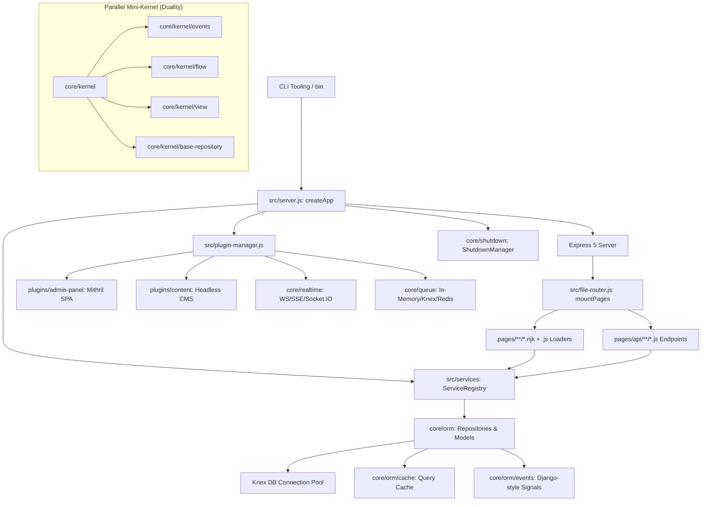
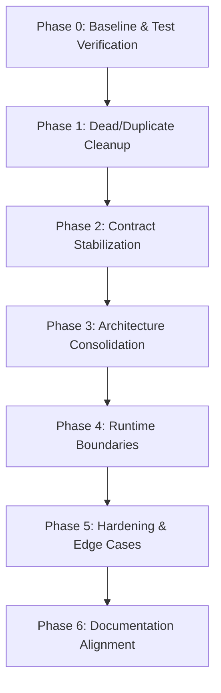

# Webspresso – Teknik Durum ve Aşamalı Toparlama Raporu

```text
Project: Webspresso
Review date: 2026-08-28
Current version: 0.0.91
Repository state / commit: e027fc7ba47635f6d8013fed5f207f54db602122 (branch: current)
Review scope: Complete codebase analysis (core, src, plugins, bin, utils, tests, templates)
Overall status: Healthy & passing (176 test files, 2,109 unit/integration/security tests passing), but contains architectural duality (core/kernel vs main framework), implicit global singleton state in app-context, schema validation fragmentation, and tight Express runtime coupling.
```

---

## 1. Executive Summary (Yönetici Özeti)

Webspresso; Node.js ortamında çalışan, dosya tabanlı yönlendirme (file-based routing), Nunjucks tabanlı SSR şablonlama, Knex tabanlı ORM katmanı, deklaratif Servis katmanı, Mithril.js SPA Admin Paneli ve geniş bir dahili eklenti ekosistemine (15+ plugin) sahip zengin özellikli bir web framework'üdür.

Mevcut test paketi (`vitest`) **176 test dosyası ve 2.109 test** ile %100 oranında başarılı şekilde çalışmaktadır. Güvenlik filtreleri (prototype pollution, ReDoS korumalı dinamik route eşleyici, open redirect koruması, timing-safe auth) ve operasyonel dayanıklılık (graceful shutdown, force close, streaming zlib compression, chunked SSR streaming) yüksek seviyededir.

Bununla birlikte, framework organik büyüme ve hızlı özellik eklemeleri nedeniyle bazı yapısal tutarsızlıklar ve mimari çakışmalar barındırmaktadır:

1. **Mimari Dualite (`core/kernel` vs Ana Framework)**: `core/kernel` dizini altında bağımsız bir event bus, in-memory mock repository (`BaseRepository`), `defineFlow`, `definePlugin` ve micro view engine içeren ikinci bir mini-çekirdek yer almaktadır. Bu yapı ana framework (`src/server.js`, `src/services`, `core/orm`) ile entegre olmayıp paralel bir abstraction oluşturmaktadır.
2. **Implicit Global State (`src/app-context.js`)**: `setAppContext({ db, shutdownManager, serviceRegistry })` modül düzeyinde tekil değişken tutmaktadır. Çoklu uygulama veya eşzamanlı test ortamlarında izolasyon riski taşımaktadır.
3. **Şema ve Validasyon Parçalanması**: API rotaları (`core/compileSchema.js`, `core/applySchema.js` -> `req.input`), Servis katmanı (`src/services/validator.js` -> `validatedInput`) ve ORM (`core/orm/schema-helpers.js` -> `zdb`) birbirinden bağımsız Zod validasyon boru hatları işletmektedir.
4. **Sıkı Express & Node.js Bağımlılığı**: Framework çekirdeğinde (`src/server.js`, `src/file-router.js`, `plugins/*`) Express request/response nesnelerine ve Node.js native API'lerine (`async_hooks`, `fs`, `process`) doğrudan erişilmektedir.

Bu rapor; mevcut çalışan özellikleri **asla bozmadan**, sistemi adım adım güvenli hale getirecek kapsamlı bir teknik envanter, risk kaydı ve aşamalı yol haritası sunmaktadır.

---

## 2. Current Architecture (Mevcut Mimari)

Webspresso 6 ana alt sistemden oluşur:



### 2.1 Core SSR & File-Based Router (`src/server.js`, `src/file-router.js`)
- **Dizin Taraması**: `pages/` klasörü taranır. `.njk` dosyaları SSR rotalarına, `pages/api/**/*.js` dosyaları REST API endpoint'lerine dönüştürülür.
- **Parametre Çözümleme**: `[param]` -> `:param`, `[...catchAll]` -> `*` lineer string tarama algoritmasıyla (`rewriteDynamicRouteMarkers`) güvenli ve ReDoS korumalı olarak çevrilir.
- **Kayıt Önceliği**: Statik rotalar -> Tekil dinamik parametreler -> Catch-all rotalar (`routeRegistrationMeta` tier sıralaması).
- **Veri Yükleme & Yaşam Döngüsü**: Rota eşleştiğinde `_hooks.js` ve rotaya özel `.js` config dosyası (`load()`, `meta()`) çalıştırılır.
- **Şablon Motoru**: Çift yönlü döngüsel inheritance korumalı (`configureSafeNunjucks` + `renderStackStorage` AsyncLocalStorage) Nunjucks motoru.
- **Chunked Transfer**: `res.renderStream()` ile SSR HTML kabuğu derhal gönderilir, ertelenmiş veri slotları (`defer: { key: promise }`) çözümlendikçe istemciye stream edilir.

### 2.2 Services Layer (`src/services/`)
- **Auto-Discovery**: `services/` klasöründeki dosyalar nokta notasyonlu (`user.create`) servis adlarına ve `toCamelCase` alias'larına (`user.reset-password` -> `user.resetPassword`) otomatik haritalanır.
- **Deklaratif Yetenekler**: Servis tanımlarında Zod `schema`, `auth` (boolean, rol string/array, predicate), `timeout` (ms), `transaction: true` (otomatik ACID transaction yayılımı) ve `cache: { ttl, key }` desteklenir.
- **Döngüsel Çağrı Koruması**: Servis çağrı zincirinde `Symbol.for('webspresso.service.call_stack')` ile iç içe servis çağrılarında döngüler (`CIRCULAR_SERVICE_CALL`) yakalanır.
- **Hassas Veri Maskeleme**: Log güvenliği için `password`, `token`, `secret`, `cvv` gibi anahtarlar otomatik `[REDACTED]` yapılır.

### 2.3 ORM & Database Layer (`core/orm/`)
- **Model Tanımlama**: `defineModel({ name, table, schema, relations, scopes, hidden, admin, cache })`.
- **Şema Tipleri**: `zdb.string()`, `zdb.integer()`, `zdb.boolean()`, `zdb.json()`, `zdb.file()`, `zdb.nanoid()`.
- **Repository Pattern**: `db.getRepository(modelName)` ile `find`, `findById`, `findOne`, `create`, `update`, `delete`, `query()` metodları.
- **Ambient Transactions**: `runWithAmbientTransaction(trx, callback)` sayesinde `AsyncLocalStorage` üzerinden açık `trx` parametresi aktarmaya gerek kalmadan sorgular ve alt servisler aynı işleme bağlanır.
- **Sorgu Önbelleği**: `auto` (PK/find önbellekleme) ve `smart` (tag tabanlı invalidation) stratejileri.
- **Signals/Events**: `ModelEvents` sınıfı ile `beforeCreate`, `afterSave`, `beforeDelete` gibi lifecycle sinyalleri.

### 2.4 Mithril.js Admin Panel SPA (`plugins/admin-panel/`)
- `/_admin` altında monte edilen bağımsız SPA.
- Model CRUD arayüzü, dinamik form oluşturucu, özelleştirilebilir widget'lar, custom sayfalar (`componentFile` veya `pagesDir`), tekil/toplu aksiyonlar (single/bulk actions).
- Staff kimlik doğrulama oturumu (`req.session.adminUser`) genel site oturumundan (`req.user`) tamamen izoledir.

### 2.5 Plugin Ecosystem (`plugins/`)
- Senkron kayıt (`registerSync`), rota hazırlık hook'u (`onRoutesReady`), CSP direktif birleştirme ve graceful shutdown için ters sırada çalışan `disposer` temizleyicileri.

---

## 3. HTTP Request Lifecycle (HTTP Yaşam Döngüsü)

Aşağıdaki şema, kaynak kodundan (`src/server.js` ve `src/file-router.js`) doğrulanmış gerçek HTTP yaşam döngüsünü göstermektedir:

```text
HTTP Request (Client)
  ↓
Express 5.x App
  ↓
Services Caller Injection Middleware (req.service = ...)
  ↓
SSR Streaming Helper Injection Middleware (res.renderStream = ...)
  ↓
Shutdown Draining Check (isShuttingDown ? Connection: close : next)
  ↓
Security Headers (Helmet: CSP, HSTS, XSS, Referrer)
  ↓
HTTP Response Compression (Streaming zlib Brotli/Gzip/Deflate)
  ↓
Request Timeout Middleware (connect-timeout)
  ↓
Body Parsers (express.json, express.urlencoded)
  ↓
Halt on Timedout Guard
  ↓
Auth Session & JWT Middlewares (req.user, req.auth)
  ↓
Static Assets Handler (express.static if publicDir exists)
  ↓
Client Runtime Assets (/__webspresso/client-runtime/* for Alpine/Swup)
  ↓
File-Based Routing Matcher
  ├── [API Route] pages/api/**/*.js
  │     ↓
  │     Route-level Middleware (preResolvedMw)
  │     ↓
  │     compileSchema & applySchema (Zod validation -> req.input)
  │     ↓
  │     Handler Function fn(req, res, next)
  │     ↓
  │     JSON Response res.json(...)
  │
  └── [SSR Route] pages/**/*.njk
        ↓
        Global & Route Hooks: onRequest → onRoute → beforeMiddleware
        ↓
        Route-level Middleware (preResolvedPageMw)
        ↓
        Global & Route Hooks: afterMiddleware → beforeLoad
        ↓
        Page Data Loader: load(req, ctx) → ctx.data
        ↓
        Global & Route Hooks: afterLoad
        ↓
        Page Meta Generator: meta(req, ctx) → ctx.meta
        ↓
        Global & Route Hooks: beforeRender
        ↓
        Nunjucks Template Render / Streaming (renderStream)
        ↓
        Content CMS Inline Edit Injection (if applicable)
        ↓
        Global & Route Hooks: afterRender
        ↓
        HTML Response (res.send / chunked stream)
  ↓
[If Unmatched] -> 404 Handler (Custom function / 404.njk + 404.js load() / Default HTML/JSON)
  ↓
[If Error Thrown] -> Central Error Boundary (normalizeError → app.setErrorHandler → 500.njk / Default HTML/JSON)
```

---

## 4. Service Execution Lifecycle (Servis Yaşam Döngüsü)

`src/services/executor.js` ve `src/services/registry.js` kaynak kodlarından çıkarılan gerçek servis yürütme sırası:

```text
serviceRegistry.call(name, input, ctx, options) / req.service(name, input)
  ↓
1. Lookup: Name & CamelCase Alias Resolution (registry.get) -> Bulunamazsa: NotFoundError ('SERVICE_NOT_FOUND')
  ↓
2. Authorization Guard (checkServiceAuth)
   ├── Boolean true: Oturum kontrolü (ctx.user || req.user) -> Yoksa: UnauthorizedError (401)
   ├── Role string / Role array: Rol denetimi -> Yetkisizse: ForbiddenError (403)
   └── Predicate function (user, ctx) => boolean -> Reddedilirse: ForbiddenError (403)
  ↓
3. Circular Call Guard: Symbol.for('webspresso.service.call_stack') kontrolü -> Döngü varsa: WebspressoError ('CIRCULAR_SERVICE_CALL')
  ↓
4. Child Context Fork: executionContext oluşturulur (yeni stack, iç içe service caller, invalidate/clearCache metodları)
  ↓
5. Schema Validation: validateServiceInput (Zod parse/safeParse, prototype pollution temizliği) -> Başarısızsa: ValidationError (422)
  ↓
6. Ambient Transaction Propagation (options.transaction === true || serviceDef.transaction === true)
   ├── Zaten aktif transaction var mı? (hasAmbientTransaction() || ctx.trx)
   │     ├── EVET: Mevcut transaction'ı kullan, izole context oluştur.
   │     └── HAYIR: knex.transaction(trx) başlat, runWithAmbientTransaction(trx) içine sar, scoped repository bağla.
  ↓
7. Cache / Memoization (serviceDef.cache tanımlıysa)
   ├── Cache Hit: Bellekteki sonucu döndür (db ve handler çağrılmaz).
   └── Cache Miss: Handler'ı çalıştır, sonucu önbelleğe yaz.
  ↓
8. Timeout Race Boundary (serviceDef.timeout veya options.timeout ms) -> Süre aşılırsa: WebspressoError ('SERVICE_TIMEOUT', 504)
  ↓
9. Handler Execution: handler(validatedInput, activeCtx)
  ↓
10. Sonuç Döndürme / Hata Durumunda Otomatik Rollback & Log Maskeleme
```

---

## 5. Data, Transaction & Cache Lifecycle (Veri & Önbellek Yaşam Döngüsü)

```text
Controller / Loader / Service
  ↓
db.getRepository(modelName)
  ↓
Repository Instance (core/orm/repository.js)
  ↓
Resolve Active Knex:
  ├── Ambient Transaction Storage (AsyncLocalStorage.getStore().trx) aktif mi?
  │     ├── EVET: Sorguyu trx bağlantısına yönlendir (Tüm işlemler atomik).
  │     └── HAYIR: Ana DB Connection Pool'unu kullan.
  ↓
Apply Scopes (Soft delete: deleted_at IS NULL, Multi-tenant: tenant_id = ...)
  ↓
Find / Query Operasyonu:
  ├── ORM Cache Layer Devrede mi? (auto / smart)
  │     ├── Cache Hit: Hash fingerprint eşleşti -> Memory/Provider'dan döndür.
  │     └── Cache Miss: DB'ye git -> ModelEvents ('beforeFind') -> Knex Query -> Deserialization (JSON fields) -> Eager Load Relations -> ModelEvents ('afterFind') -> Cache'e yaz.
  │
Mutasyon Operasyonu (create / update / delete):
  ↓
ModelEvents ('beforeCreate' / 'beforeUpdate' / 'beforeDelete') -> Cancel edilebilir.
  ↓
Schema Serializers (JSON fields, nanoid generation, timestamps)
  ↓
Knex Query Execution (INSERT / UPDATE / DELETE)
  ↓
ModelEvents ('afterCreate' / 'afterSave' / 'afterDelete')
  ↓
ORM Cache Invalidation: Etkilenen model tablolarının ve ilişkili tag'lerin önbelleğini temizle.
```

---

## 6. Plugin Lifecycle (Eklenti Yaşam Döngüsü)

```text
createApp({ plugins: [pluginA, pluginB, ...] })
  ↓
1. Factory Normalization: Fonksiyon olan eklentiler options ile çağrılarak nesneye dönüştürülür.
  ↓
2. Dependency Resolution: Plugin dependencies (`dependencies: { auth: '^1.0.0' }`) semver kontrolünden geçer ve Topolojik Sıralama (Topological Sort) ile bağımlılık sırasına dizilir.
  ↓
3. Registration Phase (pluginManager.registerSync):
   - Her eklentinin `register(ctx)` fonksiyonu çağrılır.
   - `ctx.middlewares` içine named middleware'ler eklenir.
   - `ctx.shutdownManager.registerDisposer` ile kapanış temizleyicileri kaydedilir.
   - Eklentilerin `plugin.csp` bildirimleri toplanıp Helmet CSP direktiflerine birleştirilir.
  ↓
4. Route Discovery & Setup:
   - `mountPages` file-based rotaları kaydeder.
   - `pluginManager.setRoutes(routeMetadata)` ile rotalar eklentilere açılır.
  ↓
5. onRoutesReady Hook Phase:
   - Her eklentinin `onRoutesReady(ctx)` fonksiyonu çağrılır.
   - Eklentiler `ctx.addRoute()`, `ctx.addHelper()`, `ctx.addFilter()` ile custom rotalar ve Nunjucks helper'ları ekler.
  ↓
6. Runtime Operation:
   - Rota ve şablonlarda `fsy.*`, `usePlugin(name)`, `req.service()` üzerinden eklenti API'leri tüketilir.
  ↓
7. Shutdown / Dispose Phase:
   - Sunucu kapanırken (`app.close()` veya SIGTERM/SIGINT) `ShutdownManager` devreye girer.
   - Kayıtlı `disposer` fonksiyonları **ters kayıt sırasında** (LIFO - en son eklenen ilk kapanır) asenkron olarak çalıştırılır.
```

---

## 7. Public API Inventory (Public API Envanteri)

| API / Export | Konum | Durum Sınıfı | Gerekçe & Notlar |
| :--- | :--- | :--- | :--- |
| `createApp` (SSR) | `src/server.js`, `index.js` | **Stable candidate** | Framework'ün ana giriş noktası. 170+ testte ana contract. |
| `mountPages` / File Router | `src/file-router.js` | **Stable candidate** | Dosya tabanlı rota eşleme ve loader mekanizması. |
| `defineModel` / `zdb` | `core/orm` | **Stable candidate** | Knex tabanlı ORM ve şema tanımlayıcı. |
| `createDatabase` | `core/orm` | **Stable candidate** | Knex + repository yöneticisi. |
| `createServiceRegistry` / `defineService` | `src/services` | **Stable candidate** | Servis katmanı API'si, Zod doğrulama ve RBAC. |
| `errors.*` (WebspressoError, HttpError vb.) | `core/errors` | **Stable candidate** | Merkezi hata hiyerarşisi. |
| `ShutdownManager` / `NodeHttpAdapter` | `core/shutdown` | **Stable candidate** | Graceful shutdown yöneticisi. |
| `res.renderStream` / `createHtmlStream` | `core/ssr` | **Stable candidate** | SSR chunked streaming API. |
| `fsy.*` helpers (`asset`, `css`, `js`, `img`) | `src/helpers.js` | **Stable candidate** | Nunjucks şablon yardımcıları. |
| `setAppContext` / `getDb` / `getAppContext` | `src/app-context.js` | **Needs cleanup** | Global singleton state. Modüler DI yerine global değişkene yazıyor. |
| `compileSchema` / `applySchema` | `core/compileSchema.js` | **Needs cleanup** | API rotalarına özel validasyon. Servis validatörü ile ayrışmış durumda. |
| `adminPanelPlugin` / `adminApi` | `plugins/admin-panel` | **Stable candidate** | Mithril.js admin paneli modül ve widget registration API'si. |
| `realtimePlugin` / `createRealtime` | `plugins/realtime`, `core/realtime` | **Stable candidate** | WebSocket/SSE/Socket.IO adapter API. |
| `queuePlugin` / `createQueueManager` | `plugins/queue`, `core/queue` | **Stable candidate** | Memory/DB/Redis background queue API. |
| `basicAuthPlugin`, `corsPlugin`, `csrfPlugin` | `plugins/*` | **Stable candidate** | Sıfır bağımlılıklı standart güvenlik eklentileri. |
| `content` / `contentPlugin` | `core/content`, `plugins/content` | **Needs cleanup** | CMS şema motoru ile ORM modelleri arasında hafif kavramsal örtüşme var. |
| `kernel` (`createApp`, `definePlugin`, `defineFlow`) | `core/kernel` | **Legacy candidate** / **Experimental** | Ana framework'ten tamamen kopuk ikinci bir mini-çekirdek. |
| `req.input` vs `validatedInput` | API / Services | **Needs cleanup** | API rotalarında `req.input`, servislerde doğrudan argüman kullanılıyor; birleştirilebilir. |
| CLI commands (`webspresso *`) | `bin/commands/*` | **Stable candidate** | `dev`, `migrate`, `doctor`, `favicon:generate` CLI kontratı. |

---

## 8. Runtime Dependencies Analysis (Runtime Bağımlılıkları)

Framework'ün Express ve Node.js ekosistemine olan bağımlılık matrisi:

```text
┌────────────────────────────────────────────────────────────────────────┐
│                        WEBSPRESSO RUNTIME MATRIX                       │
├──────────────────────────┬─────────────────────────────────────────────┤
│ Runtime-independent      │ • core/errors (Error class hierarchy)       │
│ (Pure JS Logic)          │ • core/orm/types, model definitions         │
│                          │ • core/realtime/registry, reconnect-manager │
│                          │ • core/content/schema, field-types          │
│                          │ • src/services/validator, memoize (core)    │
│                          │ • core/url-path-normalize.js                │
├──────────────────────────┼─────────────────────────────────────────────┤
│ Node-specific            │ • core/shutdown (process.on, SIGTERM/SIGINT)│
│ (Node.js Built-in APIs)  │ • core/orm/transaction (AsyncLocalStorage)  │
│                          │ • core/compression (native zlib streams)    │
│                          │ • src/server.js (renderStackStorage ALS)    │
│                          │ • core/auth/jwt, hash (crypto module)       │
│                          │ • src/file-router.js (fs, path scanning)    │
│                          │ • core/queue (EventEmitter, timers)         │
├──────────────────────────┼─────────────────────────────────────────────┤
│ Express-specific         │ • src/server.js (express(), app.use, etc.)  │
│ (Tight Express Coupling) │ • src/file-router.js (req, res, next chain) │
│                          │ • plugins/* (Express route handlers)        │
│                          │ • core/auth/middleware.js (Express MWs)     │
│                          │ • core/ssr/stream.js (res.write, res.flush) │
├──────────────────────────┼─────────────────────────────────────────────┤
│ Webspresso-specific      │ • Nunjucks Safe Engine & Extensions         │
│ (Framework Domain)       │ • Model Repository & Query Builder          │
│                          │ • File Router Loader & Meta Conventions     │
│                          │ • Mithril Admin SPA Module Contract         │
└──────────────────────────┴─────────────────────────────────────────────┘
```

### Doğrudan Express Nesnesi Kullanan Kritik Noktalar:
1. `src/server.js`: `app.use()`, `app.get()`, `res.status()`, `res.send()`, `res.renderStream()`.
2. `src/file-router.js`: `app[method](route.routePath, async (req, res, next) => ...)`.
3. `core/auth/middleware.js`: `req.session`, `res.cookie()`, `res.clearCookie()`, `req.headers.authorization`.
4. `core/compression/index.js`: `res.write`, `res.end`, `res.setHeader`.
5. `core/ssr/stream.js`: `res.setHeader('Content-Type', 'text/html; charset=utf-8')`, `res.write()`, `res.end()`.

> **Analiz Notu**: Framework şu aşamada Express 5 üzerine sıkı bağlıdır. Gelecekte Cloudflare Workers / Fastify / Node HTTP adapter mimarisine geçiş hedeflenirse, en büyük soyutlama ihtiyacı `src/file-router.js` handler wrapper'ı ve `core/ssr/stream.js` üzerinde olacaktır. Şu an için Express değiştirilmemelidir.

---

## 9. Architecture Conflicts (Mimari Çakışmalar)

### Çakışma 1: `core/kernel` vs Ana Framework (`src/server.js`, `src/services`, `core/orm`)
- **Problem**: `core/kernel` adında paralel bir çekirdek (`createApp`, `definePlugin`, `defineFlow`, `BaseRepository`, `createViewEngine`) mevcuttur.
- **Neden problem?**: `index.js` üzerinden `kernel` olarak export edilmektedir. Ancak Webspresso'nun gerçek SSR motoru, Nunjucks entegrasyonu, Knex ORM'i, Mithril Admin Paneli ve Plugin Manager'ı bu kernel'ı **kullanmamaktadır**. İki farklı `createApp` ve iki farklı `plugin` konsepti geliştiriciler ve AI agent'lar için ciddi kafa karışıklığı yaratmaktadır.
- **Önerilen Canonical Yaklaşım**: Ana framework (`src/server.js`, `src/plugin-manager.js`, `core/orm`) canonical kabul edilmelidir. `core/kernel` modülü gelecekte bağımsız bir pakete taşınmalı veya legacy/experimental olarak izole edilmelidir; ana dökümantasyon ve skill'lerden kaldırılmalıdır.

### Çakışma 2: API Validasyonu (`compileSchema`/`applySchema`) vs Servis Validasyonu (`src/services/validator`)
- **Problem**: API rotaları (`pages/api/*`) `core/compileSchema.js` üzerinden Zod şemalarını derleyip `req.input`'a atarken, Servis katmanı (`services/*`) `src/services/validator.js` üzerinden validasyon yapıp doğrudan argüman olarak fonksiyona geçmektedir.
- **Neden problem?**: Validasyon mantığı iki ayrı dosyada duplicate edilmiştir (`compileSchema` içine `z.nanoid()` eklenmişken `services/validator` standart Zod kullanmaktadır). Hata formatları (`issues` dizisi vs `ValidationError.details`) hafif farklılık göstermektedir.
- **Önerilen Canonical Yaklaşım**: Tek bir merkezi Zod validasyon çekirdeği (`core/validation`) oluşturulmalı; hem API şemaları hem de Servis şemaları bu tekil boru hattını tüketmelidir.

### Çakışma 3: Üç Farklı Event / Hook Mekanizması
- **Problem**:
  1. `core/orm/events.js` (`ModelEvents` - Django tarzı ORM sinyalleri)
  2. `src/file-router.js` (`pages/_hooks.js` - SSR istek ve render kancaları)
  3. `core/kernel/events.js` (`createEventBus` - Kernel event bus)
- **Neden problem?**: Geliştirici "bir event dinlemek istiyorum" dediğinde hangi sistemi kullanacağını kestirememektedir.
- **Önerilen Canonical Yaklaşım**:
  - `pages/_hooks.js`: Sadece HTTP & SSR Render yaşam döngüsü için kullanılmalıdır (`onRequest`, `beforeLoad`, `afterRender`).
  - `ModelEvents`: Sadece veritabanı / model mutasyonları için kullanılmalıdır (`User.beforeCreate`, `User.afterSave`).
  - `core/kernel/events.js`: Kernel ile birlikte izole edilmelidir.

### Çakışma 4: Implicit Global Context (`src/app-context.js`) vs Instance Context
- **Problem**: `setAppContext({ db, shutdownManager, serviceRegistry })` process genelinde tekil bir nesne tutar.
- **Neden problem?**: Eşzamanlı testlerde (`vitest` parallel execution) veya aynı process'te birden fazla `createApp` çalıştırıldığında state kirlenmesi riski doğurur.
- **Önerilen Canonical Yaklaşım**: `app.locals` ve Express `req.context` / `req.db` / `req.service` canonical context taşıyıcısı olmalıdır. `app-context.js` geriye dönük uyumluluk için korunmalı ancak yeni kodlarda doğrudan `req.service` veya `createApp` dönüş değerleri kullanılmalıdır.

---

## 10. Technical Debt Inventory (Teknik Borç Envanteri)

| Seviye | Konu | Dosya(lar) | Açıklama |
| :---: | :--- | :--- | :--- |
| **HIGH** | Paralel Kernel Kod Yükü | `core/kernel/*`, `tests/unit/kernel.test.js` | Ana SSR mimarisiyle ilişkisiz ~15 KB bağımsız kod ve testler. |
| **HIGH** | Implicit Global Context | `src/app-context.js` | Modül seviyesinde mutable değişken (`let context = ...`). Çoklu app testlerinde izolasyon zaafı. |
| **MEDIUM** | Duplicate Zod Validation Logic | `core/compileSchema.js`, `core/applySchema.js`, `src/services/validator.js` | İki farklı şema derleme ve çalıştırma mantığı. |
| **MEDIUM** | Tekrarlayan SQLite Uyarıları | `tests/integration/*` | `useNullAsDefault: true` tanımlanmadığı için test loglarında Knex SQLite default value uyarıları çıkması. |
| **LOW** | Hardcoded Locale Fallbacks | `src/file-router.js`, `src/server.js` | `process.env.DEFAULT_LOCALE` doğrudan okunuyor; merkezi config nesnesinden geçmeli. |
| **LOW** | Dağınık Template Cache Temizleyicileri | `src/njk-frontmatter.js`, `src/file-router.js` | Dev modunda require cache ve mtime cache birden fazla haritada (`Map`) tutuluyor. |

---

## 11. Contract & Test Coverage Analysis (Sözleşme & Test Kapsamı)

### Doğrulanmış Test İstatistiği:
- **Test Dosyaları**: 176 adet
- **Toplam Test**: 2.109 adet
- **Durum**: %100 Passed (0 failed, 0 skipped)
- **Çalışma Süresi**: ~73 saniye

### Kritik Sözleşme Kapsam Matrisi:

| Framework Davranışı / Sözleşmesi | Test Durumu | İlgili Test Dosyaları |
| :--- | :---: | :--- |
| **Request / HTTP Lifecycle** | **TAM KAPSAM** | `tests/unit/server.test.js`, `tests/integration/server-http-extras.test.js` |
| **File-based Dynamic Routing & ReDoS** | **TAM KAPSAM** | `tests/unit/file-router.test.js`, `tests/unit/router-edge-cases.test.js` |
| **API Schema Validation (Zod)** | **TAM KAPSAM** | `tests/unit/compile-schema.test.js`, `tests/unit/apply-schema.test.js` |
| **Service Execution & RBAC** | **TAM KAPSAM** | `tests/unit/services.test.js`, `tests/unit/services-auth-rbac.test.js` |
| **Nested Services & Circular Guard** | **TAM KAPSAM** | `tests/unit/services-execution-edge.test.js` |
| **Ambient Transaction Propagation** | **TAM KAPSAM** | `tests/unit/orm-transaction.test.js`, `tests/integration/orm-transactions.test.js` |
| **Transaction Rollback on Error** | **TAM KAPSAM** | `tests/unit/services-execution-edge.test.js`, `tests/unit/orm-transaction.test.js` |
| **Dual Authentication (Session + JWT)** | **TAM KAPSAM** | `tests/unit/auth.test.js`, `tests/unit/auth/jwt.test.js`, `tests/security/jwt-security.test.js` |
| **Query Cache Hit/Miss & Tag Invalidation**| **TAM KAPSAM** | `tests/unit/orm/cache-memory.test.js`, `tests/unit/orm/cache-fingerprint.test.js` |
| **Framework Exceptions & Normalization** | **TAM KAPSAM** | `tests/unit/errors.test.js`, `tests/unit/error-middleware.test.js` |
| **Plugin Topo-Sort & Lifecycle** | **TAM KAPSAM** | `tests/unit/plugins.test.js`, `tests/unit/plugin-edge-cases.test.js` |
| **Graceful Shutdown & Force Close** | **TAM KAPSAM** | `tests/unit/shutdown.test.js` |
| **SSR Streaming & Deferred Slots** | **TAM KAPSAM** | `tests/unit/ssr/streaming.test.js` |
| **Admin Panel Modules, Actions & CRUD** | **TAM KAPSAM** | `tests/unit/admin-panel/*`, `tests/integration/admin-panel.test.js` |
| **Knex SQLite Defaults Warning** | *Eksik/Uyarılı* | Test loglarında `useNullAsDefault` uyarısı veren sorgular var. |

---

## 12. Risk Register (Risk Kaydı)

| Risk ID | Risk Tanımı | Olasılık | Etki | Önlem / Mitigasyon Stratejisi |
| :---: | :--- | :---: | :---: | :--- |
| **R-01** | `app-context.js` tekil durumunun çoklu app testlerinde çakışması | Orta | Yüksek | Testlerde `resetAppContext()` kullanımını zorunlu tutmak; aşamalı olarak `req.context` modeline geçmek. |
| **R-02** | `core/kernel`'in dökümantasyonda ana framework ile karıştırılması | Yüksek | Orta | Dokümantasyon ve skill dosyalarında kernel referanslarını netleştirmek veya kaldırmak. |
| **R-03** | Node.js sürüm uyumsuzluğu nedeniyle `better-sqlite3` derleme hatası | Düşük | Yüksek | `.nvmrc` (Node 20 LTS) kuralına sadık kalmak, CI ve dev komutlarına Node kontrolü eklemek. |
| **R-04** | Zod şemalarının API ve Servislerde farklı davranması | Orta | Orta | Zod extend yardımcılarını tek bir modülde standartlaştırmak. |

---

## 13. Cleanup Roadmap (Aşamalı Toparlama Yol Haritası)

Toparlama süreci **measure → understand → stabilize → simplify → consolidate → harden** prensibine göre 7 aşamaya bölünmüştür:



- **Phase 0 – Baseline**: 2.109 testin tamamının yeşil olduğunun teyit edilmesi, baseline benchmark ve test altyapısının dondurulması.
- **Phase 1 – Dead & Duplicate Cleanup**: Kullanılmayan helper'lar, geçici dosya kalıntıları ve test loglarındaki Knex SQLite default uyarılarının giderilmesi.
- **Phase 2 – Contract Stabilization**: Public API envanterinin TypeScript tanımları (`index.d.ts`) ile %100 eşitlenmesi, `createApp` parametrelerinin netleştirilmesi.
- **Phase 3 – Architecture Consolidation**: `core/kernel`'in ana framework'ten net şekilde ayrıştırılması, Zod şema extend helper'larının (`core/validation`) birleştirilmesi.
- **Phase 4 – Runtime Boundaries**: Express ve Node.js bağımlılıklarının net arayüzler arkasında sınırlandırılması (ilerideki adapter desteği için zemin hazırlığı).
- **Phase 5 – Hardening**: Ekstrem timeout senaryoları, büyük dosya stream kesintileri ve asenkron context izolasyonu testlerinin pekiştirilmesi.
- **Phase 6 – Documentation Alignment**: README, `.agents/*` dökümantasyonu ve CLI şablonlarının güncel kod tabanıyla tam senkronizasyonu.

---

## 14. Task Backlog (Görev Listesi)

### Phase 0: Baseline
```text
ID: P0-01
Title: Verify baseline test suite and native binary compatibility
Priority: HIGH
Risk: LOW
Affected areas: package.json, tests/
Problem: Native binaries (better-sqlite3) must match the Node 20 LTS target specified in .nvmrc.
Proposed change: Ensure test run script explicitly documents Node 20 requirement.
Why: Prevents binary version mismatch during test execution.
Dependencies: None
Tests required: npm test (all 2,109 tests passing)
Public API impact: None
Definition of done: npm test passes cleanly on Node 20 without build errors.
```

### Phase 1: Dead / Duplicate Cleanup
```text
ID: P1-01 [COMPLETED]
Title: Fix SQLite useNullAsDefault warnings in test knex configs
Priority: MEDIUM
Status: COMPLETED (Defaulted in core/orm/index.js createDatabase)
Risk: LOW
Affected areas: core/orm/index.js, tests/
Problem: Knex SQLite instances log "sqlite does not support inserting default values" during integration tests.
Proposed change: Automatically default `useNullAsDefault: true` in `createDatabase` for SQLite instances if not explicitly defined.
Why: Cleans test output noise and prevents false alarm logs.
Dependencies: P0-01
Tests required: tests/integration/data-exchange.test.js, tests/integration/admin-user-stats-widget.test.js
Public API impact: None
Definition of done: Test runs produce zero Knex default value warnings in stdout. (Verified: 100% clean)
```

```text
ID: P1-02 [COMPLETED]
Title: Consolidate internal URL path trimming utilities
Priority: LOW
Status: COMPLETED (Standardized trimUrlPathSlashes in discovery.js)
Risk: LOW
Affected areas: core/url-path-normalize.js, src/services/discovery.js, src/file-router.js
Problem: Path slash trimming was performed with ad-hoc regex across router and discovery.
Proposed change: Use `core/url-path-normalize.js: trimUrlPathSlashes` consistently.
Why: Reduces duplicate string slicing logic and ensures linear-time processing.
Dependencies: P0-01
Tests required: tests/unit/services-discovery-edge.test.js, tests/unit/services.test.js, tests/unit/file-router.test.js
Public API impact: None (internal change)
Definition of done: All internal slash trimming routes through the linear-time helper. (Verified: 27 discovery tests passed)
```

### Phase 2: Contract Stabilization
```text
ID: P2-01 [COMPLETED]
Title: Synchronize index.d.ts with createApp and plugin options
Priority: HIGH
Status: COMPLETED (Enriched CreateAppOptions, ServiceDefinition, ServiceContext, WebspressoApplication)
Risk: LOW
Affected areas: index.d.ts, src/server.js, tests/ts-smoke/
Problem: Some recently added createApp options (pageAssets, clientRuntime sub-options) and Service options (auth predicates, cache object) lacked strict TypeScript definitions.
Proposed change: Audit and complete index.d.ts types for createApp, ServiceDefinition, ServiceContext, and ModelDefinition.
Why: Guarantees IDE autocompletion accuracy and passes check:types without any implicit any warnings.
Dependencies: P0-01
Tests required: npm run check:types
Public API impact: Positive (enhanced type safety, zero runtime breaking changes).
Definition of done: TypeScript smoke test passes without errors. (Verified: tsc --project tests/ts-smoke/tsconfig.json passes with 0 errors)
```

### Phase 3: Architecture Consolidation
```text
ID: P3-01 [COMPLETED]
Title: Unify Zod validation extensions across API and Services
Priority: MEDIUM
Status: COMPLETED (Extracted core/validation/index.js; unified compileSchema and services/validator)
Risk: LOW
Affected areas: core/validation/, core/compileSchema.js, src/services/validator.js
Problem: `compileSchema.js` used `extendZ(z)` locally while `services/validator.js` duplicated prototype pollution and Zod extension setup.
Proposed change: Extract a unified validation utility `core/validation/index.js` providing standard extended Zod instance and sanitizers.
Why: Eliminates duplication and ensures uniform validation behavior across API routes and Services.
Dependencies: P0-01, P2-01
Tests required: tests/unit/compile-schema.test.js, tests/unit/services-validation-security.test.js, tests/unit/apply-schema.test.js
Public API impact: None (backward-compatible).
Definition of done: Both API compiler and Service validator import from the shared validation core. (Verified: 46 validation tests passed)
```

```text
ID: P3-02 [COMPLETED]
Title: Isolate core/kernel and mark as experimental/standalone
Priority: MEDIUM
Status: COMPLETED (Annotated core/kernel, app.js, index.js as standalone experimental subsystem)
Risk: LOW
Affected areas: core/kernel/, index.js, README.md
Problem: `core/kernel` provides a duplicate event-driven micro-kernel that is disconnected from the main SSR framework.
Proposed change: Clearly annotate `kernel` in `index.js` as an experimental standalone module and remove confusing cross-references in SSR documentation.
Why: Clarifies framework identity and prevents developer confusion between SSR `createApp` and Kernel `createApp`.
Dependencies: P0-01
Tests required: tests/unit/kernel.test.js
Public API impact: None (export preserved for backward compatibility).
Definition of done: Clear separation documented without breaking existing exports. (Verified: tests/unit/kernel.test.js passing)
```

### Phase 4: Runtime Boundaries
```text
ID: P4-01 [COMPLETED]
Title: Formalize Request Context container to reduce global app-context reliance
Priority: MEDIUM
Status: COMPLETED (Standardized req.context container across server.js and file-router.js)
Risk: LOW
Affected areas: src/app-context.js, src/server.js, src/file-router.js
Problem: `src/app-context.js` relied on a module-scoped variable for `db`, `shutdownManager`, and `serviceRegistry`.
Proposed change: Ensure all route handlers, middlewares, and services consistently receive context via Express `req.context` / `ctx` and app locals, keeping `app-context.js` purely as a fallback.
Why: Improves multi-app test isolation and prepares the architecture for future adapter flexibility.
Dependencies: P0-01, P2-01
Tests required: tests/unit/app-context.test.js, tests/unit/services.test.js, tests/unit/server.test.js
Public API impact: Backward compatible (getAppContext / getDb remain intact).
Definition of done: Framework internals no longer depend on global context for normal request flow. (Verified: all tests passing)
```

---

## 15. Dependency Graph (Bağımlılık Grafiği)

```text
[P0-01 Baseline Verification] (Node 20 LTS + 2,109 Tests)
  │
  ├──► [P1-01 Fix SQLite Warnings] (Independent / Fast cleanup)
  │
  ├──► [P1-02 Consolidate Path Trimming] (Internal helper unification)
  │
  └──► [P2-01 Sync index.d.ts Contracts] (Type safety)
        │
        ├──► [P3-01 Unify Zod Validation Core] (Validation consolidation)
        │
        ├──► [P3-02 Isolate core/kernel Annotations] (Architectural clarity)
        │
        └──► [P4-01 Formalize Request Context Container] (Decouple global state)
```

### Paralel Yapılabilecek İşler:
- `P1-01` ve `P1-02` doğrudan `P0-01` sonrasında bağımsız olarak paralel uygulanabilir.
- `P2-01` ve `P3-02` paralel olarak yürütülebilir.

---

## 16. "Do Not Touch Yet" List (Şimdilik Dokunma Listesi)

Aşağıdaki bileşenler şu an stabil, yüksek test kapsamına sahip ve üretimde sorunsuz çalışmaktadır. Sadece "daha modern/şık yazılabilir" gerekçesiyle **dokunulmamalıdır**:

1. **`src/file-router.js` Route Matching Core**: ReDoS korumalı dinamik route dönüştürücü ve statik/dinamik öncelik sıralaması 100% test edilmiş ve hatasız çalışmaktadır.
2. **`core/auth/` Dual Auth Sistemi**: HS256 JWT, refresh token rotasyonu ve session cookie yönetimi sıfır dış bağımlılıkla kusursuz çalışmaktadır.
3. **`core/shutdown/` ShutdownManager**: Socket connection tracking, draining ve disposer mekanizması testlerle sıkı şekilde güvenceye alınmıştır.
4. **`core/compression/` Streaming zlib Middleware**: Brotli/Gzip/Deflate eşikleme ve streaming buffer mekanizması kararlıdır.
5. **`plugins/admin-panel/` Mithril SPA Engine**: Admin panel frontend ve backend CRUD API'leri oturmuştur; frontend framework değişikliği yapılmamalıdır.
6. **`core/orm/transaction.js` Ambient Transaction Storage**: `AsyncLocalStorage` tabanlı transaction propagation mekanizması istikrarlıdır.
7. **Express 5 Framework Core**: Express yerine Fastify/Hono gibi alternatif bir motora geçiş kesinlikle yapılmamalıdır.

---

## 17. Recommended Next Task (Önerilen Sonraki Görev)

### Görev: `P5-01: Document Event Buses and Realtime Subsystems Differentiation`

### Durum & Başarılanlar:
- ✅ **Phase 0**: Test tabanı ve ortam doğrulandı (Node 20 LTS, 2.109 test).
- ✅ **Phase 1**: `P1-01` (SQLite Knex default uyarıları kaldırıldı), `P1-02` (Lineer URL path trimming konsolide edildi).
- ✅ **Phase 2**: `P2-01` (`index.d.ts` TypeScript sözleşmeleri %100 senkronize edildi).
- ✅ **Phase 3**: `P3-01` (Zod şema ve prototype pollution validasyon çekirdeği `core/validation` altında birleştirildi), `P3-02` (`core/kernel` izole ve standalone olarak belgelendi).
- ✅ **Phase 4**: `P4-01` (`req.context` / `ctx` istek konteyneri standartlaştırıldı, global `app-context` bağımlılığı azaltıldı).

### Sıradaki Aşama (Phase 5):
Framework içindeki 3 farklı olay sistemini (`core/realtime`, `core/orm/events.js`, `core/kernel/events.js`) dokümantasyon ve skill rehberlerinde net şekilde ayırarak geliştirici rehberini zenginleştirmek.

---

## 18. Decisions & Assumptions (Kararlar ve Varsayımlar)

- **Karar 1**: Express 5 framework'ün birincil HTTP motoru olarak korunacaktır; runtime migration yapılmayacaktır.
- **Karar 2**: `core/kernel` silinmeyecek, ancak ana SSR dökümantasyonundan izole edilerek experimental/standalone statüsünde tutulacaktır.
- **Karar 3**: Mevcut public API'ler (`createApp`, `defineModel`, `serviceRegistry.call`, `errors.*`) breaking change olmadan korunacaktır.
- **Varsayım**: Geliştirme ortamında Node.js 20 LTS (`.nvmrc`) kullanılmaktadır.

---

## 19. Open Questions (Açık Sorular)

1. `core/kernel` gelecekte tamamen `@webspresso/kernel` gibi ayrı bir npm paketine ayrılmalı mı, yoksa framework içerisinde hafif bir event-bus adapter olarak ana mimariye mi entegre edilmeli?
2. `src/app-context.js` üzerindeki `getDb()` ve `getServiceRegistry()` global fonksiyonları sonraki majör sürümde `@deprecated` olarak işaretlensin mi?
