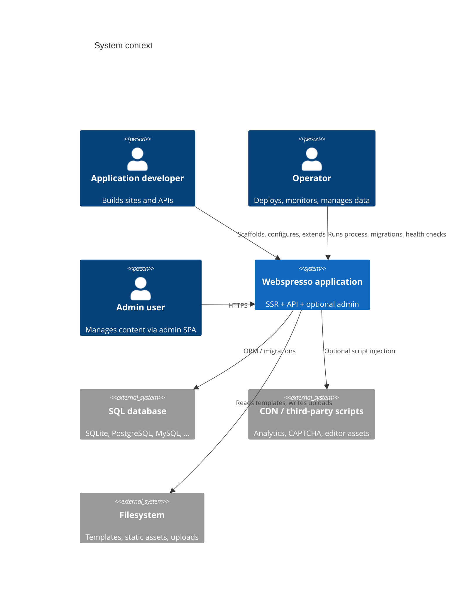
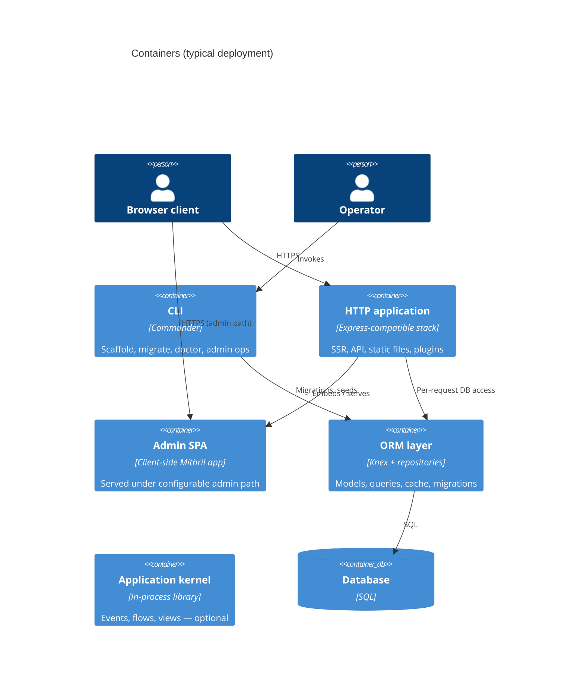

# Webspresso — Architecture (C4-style)

> **Purpose:** Language- and platform-neutral map of the system, organized by **feature sets**.  
> **Audience:** Contributors, reviewers, and agents extending the framework.  
> **Maintenance:** Update this file whenever a feature set gains or loses a capability (see [§ Maintenance protocol](#maintenance-protocol)).

| Meta | Value |
|------|--------|
| Last reviewed | 2026-08-10 |
| Package version | 0.0.84 |
| Primary runtime | Node.js ≥ 18 (HTTP server process) |
| Secondary runtime | Optional in-process application kernel (no HTTP) |

---

## Maintenance protocol

**When to update this document**

| Trigger | Action |
|---------|--------|
| New built-in plugin | Add row to [§ Built-in plugins](#built-in-plugins); update container diagram if it introduces a new boundary |
| New CLI command | Add to [§ CLI feature set](#cli-feature-set) |
| New ORM / auth / admin capability | Extend the relevant feature-set section + component table |
| New extension point (hook, registry, API) | Add to [§ Extension points](#extension-points) |
| Breaking change to request pipeline or plugin order | Update [§ Request lifecycle](#request-lifecycle) and [§ Composition rules](#composition-rules) |
| New published export from package root | Update [§ Public surface](#public-surface) |

**How to update**

1. Edit the feature-set section (not only the changelog).
2. Bump **Last reviewed** and, if shipped, **Package version**.
3. Add one line to [Changelog](#changelog) at the bottom.

Agents and contributors: treat this file as the **canonical structural index**; narrative detail stays in `README.md` and `doc/index.html`.

---

## Level 1 — System context

Webspresso is a **server-rendered web application framework** with file-based routes, optional relational persistence, a plugin ecosystem, and operator tooling (CLI + admin UI).



| Actor | Goal |
|-------|------|
| Application developer | Ship SSR pages and JSON APIs with minimal boilerplate |
| Operator | Run one or more server processes; optional admin and audit tooling |
| Admin user | CRUD on ORM-backed models without custom back-office code |

**Out of scope (by design):** bundled hosting, multi-tenant SaaS control plane, mobile clients. Apps bring their own deployment target.

---

## Level 2 — Containers

Major **deployable or runtime boundaries** inside a typical application.



| Container | Code anchor | Responsibility |
|-----------|-------------|----------------|
| **CLI** | `bin/` | Project lifecycle; no long-running server |
| **HTTP application** | `src/server.js` → `createApp()` | Middleware, routing, rendering, plugin orchestration |
| **File router** | `src/file-router.js` | Maps `pages/` tree to SSR and API handlers |
| **Template runtime** | Nunjucks + `src/helpers.js` | `fsy.*` helpers, assets, i18n in templates |
| **Plugin host** | `src/plugin-manager.js` | Dependency order, lifecycle, inter-plugin APIs |
| **ORM** | `core/orm/` | Schema, repositories, migrations, optional query cache |
| **Site authentication** | `core/auth/` | Session auth for public site (`req.user`) — separate import path |
| **Admin SPA** | `plugins/admin-panel/client/` | Mithril parts bundle; admin session (`adminUser`) |
| **Application kernel** | `core/kernel/` | Event bus, flows, minimal views — **not** the HTTP `createApp` |
| **OpenAPI helpers** | `core/openapi/` | Spec generation for API documentation plugins |

**Note:** `createApp` (SSR) and `kernel.createApp` (in-process) are **different entry points** with the same name.

---

## Level 3 — Components by feature set

### Core HTTP & routing

| Component | Responsibility |
|-----------|----------------|
| `createApp` | Assemble Express app, plugins, routes, error pages |
| File router | `pages/**/*.njk` → SSR; `pages/api/*.{method}.js` → API |
| Route config | Sibling `.js`: `load`, `meta`, `middleware`, `hooks` |
| API validation | Zod `schema` → `req.input`; 400 on failure |
| Global hooks | `pages/_hooks.js` lifecycle |
| i18n | Locale JSON; `t()` in templates; route-level overrides |
| Client runtime | Optional Alpine + swup at `/__webspresso/client-runtime/*` |
| Security headers | Helmet; CSP stricter in production |
| Static assets | `publicDir`; optional hashed manifest via `assets` config |

### ORM & database

| Component | Responsibility |
|-----------|----------------|
| `zdb` schema builders | Column types including `file`, `nanoid`, relations |
| `defineModel` | Table mapping, `admin`, `rest`, `cache`, `hidden`, scopes |
| `createDatabase` | Knex instance + model auto-load |
| Repository | CRUD, `query()` builder, pagination, soft delete |
| Migrations / seeds | Knex migrations; CLI + `core/orm/seeder` |
| Transactions | `db.transaction(trx => …)` |
| Query cache | Opt-in memory provider; `db.cache.*` API |
| ORM events | `beforeCreate`, `afterFind`, … |

### Authentication (dual boundary & dual auth)

Webspresso features a **Dual Authentication (Session + JWT)** architecture designed to seamlessly serve both SSR web applications and REST API / Mobile / SPA clients:

- **Session + Cookie Auth (Stateful)**: Primary auth mechanism for browser-rendered SSR routes (`/`, `/dashboard`) and Admin Panel (`/_admin`). Uses `httpOnly` secure cookies for XSS protection and immediate server-side session revocation.
- **JWT + Refresh Token Auth (Stateless)**: Built-in zero-dependency HS256 JWT auth for REST APIs and mobile/SPA clients (`/api/*`). Uses `Authorization: Bearer <token>` for access tokens (short-lived) and rotatable Refresh Tokens (long-lived).

| Layer | Session / Token | Identity store | Typical login |
|-------|-----------------|----------------|---------------|
| **Site SSR auth** | App session (`userId`) & `remember_token` | App model (e.g. `User`) | Custom routes via `setupRoutes` |
| **Site REST/API auth** | JWT Bearer Access Token & Refresh Token | App model (e.g. `User`) | `/api/login` returning `{ accessToken, refreshToken }` |
| **Admin auth** | Admin session (`adminUser`) | `admin_users` table | `/_admin` SPA |

| Component | Responsibility |
|-----------|----------------|
| `createAuth` / `quickAuth` | Credential verify, session, remember-me, and opt-in JWT / Refresh Token manager |
| `signJwt` / `verifyJwt` | Zero-dependency HS256 HMAC-SHA256 JWT signing, verifying, and duration parsing |
| `generateRefreshToken` / `refreshAccessToken` | Long-lived refresh token generation & automatic token rotation |
| `authenticate` middleware | **Dual-Auth Evaluator**: Checks `Authorization: Bearer <token>` header first; falls back to Session cookie, then Remember-Me cookie |
| `requireJwt` middleware | Enforces valid Bearer Access Token on API endpoints (rejects refresh tokens for access) |
| Policies / gates | `can`, `authorize`, route `middleware: ['auth']` / `middleware: ['jwt']` |
| `requireAuth` / `requireGuest` | Redirect or JSON 401; stores `intendedUrl` on site auth (app must consume on login POST) |
| Admin `auth.js` | Setup, login, logout, `requireAuth` for admin API |
| Admin intended route | Client `sessionStorage` — return to protected SPA route after login |

### Admin panel

| Component | Responsibility |
|-----------|----------------|
| Admin plugin | Registers admin path, API, serves SPA HTML |
| Admin registry | Models, menus, widgets, `uploadUrl`, custom pages |
| CRUD API | List/create/update/delete from model metadata |
| Field renderers | Types: text, number, boolean, json, rich-text, **file-upload**, relations |
| `customFields` | Override UI for columns (e.g. `file-upload` on string columns) |
| `registerModule` / `registerPageDir` | Plugin extension: pages, menu, API, widgets (`componentFile`, `pagesDir`, custom HTML/URL pages, SSR scripts & styles, auto `layout`) |

| User management | Optional CRUD for site users inside admin |
| Rich text | Quill (CDN); HTML sanitized on save by default |
| File upload UI | POST to `uploadUrl`; image preview; stores URL in model |

### Built-in plugins

Plugins declare `name`, `version`, optional `dependencies`, and lifecycle hooks (`register`, `onRoutesReady`, `onReady`).

| Plugin | Feature set | One-line purpose |
|--------|-------------|------------------|
| `corsPlugin` | Security / HTTP | Zero-dependency CORS middleware & preflight handling |
| `redirectPlugin` | HTTP | Configurable redirects before file routes |
| `rateLimitPlugin` | HTTP | Named rate-limit middleware + optional global limiter |
| `uploadPlugin` | HTTP / admin | Multipart upload endpoint + pluggable storage |
| `healthCheckPlugin` | Ops | Liveness/readiness HTTP probe |
| `restResourcePlugin` | API | Auto REST CRUD from model metadata |
| `swaggerPlugin` | API / docs | OpenAPI 3 + Swagger UI from API routes |
| `schemaExplorerPlugin` | API / docs | JSON ORM schema endpoint |
| `recaptchaPlugin` | Security | reCAPTCHA verify middleware + helpers |
| `emailPlugin` | HTTP / Admin | MJML + Nodemailer email sending with optional admin UI and auth integration |
| `adminPanelPlugin` | Admin | ORM-backed CRUD SPA |
| `contentPlugin` | Admin / CMS | Schema-driven content types, entries, public API, inline edit |
| `dataExchangePlugin` | Admin | Excel export + CSV/XLSX import |
| `siteAnalyticsPlugin` | Analytics | Self-hosted page views + admin charts |
| `auditLogPlugin` | Compliance | Admin mutation audit trail |
| `ormCacheAdminPlugin` | Ops / ORM | Admin UI for query-cache metrics |
| `sitemapPlugin` | SEO | `sitemap.xml`, `robots.txt` |
| `analyticsPlugin` | SEO / marketing | Third-party tracker injection |
| `seoCheckerPlugin` | Dev / SEO | Client-side SEO audit toolbar |
| `dashboardPlugin` | Dev | Route browser at `/_webspresso` |

**Package root re-exports** a subset; full list: `require('webspresso/plugins')`.

### CLI feature set

| Group | Commands |
|-------|----------|
| **Scaffold** | `new`, `page`, `api`, `add tailwind` |
| **Server** | `dev`, `start` |
| **Database** | `db:migrate`, `db:rollback`, `db:status`, `db:make`, `db:scaffold`, `seed` |
| **Admin** | `admin:setup`, `admin:password`, `admin:list` |
| **Ops** | `doctor`, `upgrade`, `audit:prune`, `orm:map`, `favicon:generate` |
| **Agent tooling** | `skill` (Cursor skill bundle) |

### Client runtime & assets

| Component | Responsibility |
|-----------|----------------|
| `resolveClientRuntime` | Feature flags: Alpine, swup |
| Asset manager | Manifest-based hashed CSS/JS URLs in templates |
| Tailwind (scaffold) | App-level `build:css`; not part of core HTTP container |

### Application kernel (optional)

| Component | Responsibility |
|-----------|----------------|
| Event bus | `dispatch` (sequential) / `publish` (concurrent) |
| `defineFlow` | Trigger → condition → ordered actions |
| `definePlugin` | Kernel plugins: events + inline views |
| `BaseRepository` | In-memory store emitting `orm.<resource>.*` events |
| View engine | Namespaced minimal templates (`ns::page`) |

### Quality & tooling (repository)

| Component | Responsibility |
|-----------|----------------|
| Vitest | Unit + integration tests |
| Playwright | Browser E2E (admin, auth, plugins) |
| TypeScript smoke | `index.d.ts` validation |
| Benchmarks | Vitest bench + CI regression script |

---

## Request lifecycle

Order matters for correct behavior and security.

```
Incoming HTTP request
  → Security / timeout middleware
  → Body parsers
  → [Site auth session middleware] (if configured)
  → Static files
  → Client runtime routes
  → Plugin register() phase [e.g. redirect rules]
  → File-based routes (API + static SSR patterns)
  → Plugin onRoutesReady() [upload, admin, swagger, health, …]
  → setupRoutes() (application custom routes)
  → Dynamic / catch-all file routes (must be last)
  → 404
  → Central error handler
```

---

## Composition rules

| Rule | Reason |
|------|--------|
| `uploadPlugin` before `adminPanelPlugin` | Admin reads `uploadUrl` / `webspresso.uploadPath` for file fields |
| `adminPanelPlugin` before `dataExchangePlugin`, `siteAnalyticsPlugin`, `auditLogPlugin`, `ormCacheAdminPlugin`, `emailPlugin` | Shared admin session and registry |
| `redirectPlugin` early | Must run before file routes |
| `createApp({ db })` when using ORM plugins | Exposes `ctx.db` / `req.db` |
| Site `auth` + `adminPanelPlugin({ auth })` | Optional site-user session UI in admin |
| Login GET in `setupRoutes`, not `pages/login.njk` | Avoid route order bypassing `requireGuest` |

---

## Extension points

| Mechanism | Use for |
|-----------|---------|
| `createApp({ plugins })` | Built-in or custom plugins |
| `createApp({ setupRoutes })` | Login, webhooks, custom Express routes |
| `createApp({ middlewares })` | Reusable named middleware in route configs |
| `createApp({ auth })` | Site-wide session authentication |
| Plugin `register` / `onRoutesReady` | Routes, helpers, CSP, injections |
| `ctx.usePlugin(name)` | Inter-plugin APIs |
| `ctx.addHelper` / `addFilter` | Template surface |
| `defineModel({ admin, rest, hooks, cache })` | Admin UI, REST exposure, ORM behavior |
| `adminPanelPlugin({ configure })` / `registerModule` | Admin menus, pages, widgets, APIs |
| `admin.customFields` / `zdb.file()` | Admin form widgets |
| `pages/_hooks.js` + per-route `hooks` | Cross-cutting request logic |
| `kernel.definePlugin` / `defineFlow` | Non-HTTP domain logic |

### Plugin contract (conceptual)

```
{
  name, version, description?,
  dependencies?: { "other-plugin": semver },
  csp?: { ... },
  api?: { ... },
  register(ctx),
  onRoutesReady(ctx),
  onReady?(ctx)
}
```

---

## Public surface

| Import | Exports (high level) |
|--------|----------------------|
| `webspresso` | `createApp`, router utils, ORM, kernel, selected plugins |
| `webspresso/plugins` | All built-in plugins |
| `webspresso/core/auth` | Site auth (`createAuth`, `quickAuth`, hash, middleware) |
| `webspresso/core/orm` | ORM submodules |
| `webspresso/build/*` | Build/runtime manifests (when present in distribution) |

---

## Documentation map

| Document | Role |
|----------|------|
| **`docs/ARCHITECTURE.md`** (this file) | C4-style structure; feature-set index; update on structural changes |
| `README.md` | Narrative reference, examples, pitfalls |
| `doc/index.html` | Single-page HTML docs with anchors |
| `.agents/skills/webspresso-usage/REFERENCE-framework.md` | Condensed SSR/API/ORM/plugins/CLI |
| `.agents/skills/webspresso-usage/REFERENCE-kernel.md` | Kernel-only reference |

| `docs/getting-started.md` | Onboarding |
| `docs/production-checklist.md` | Production hardening |
| `plugins/admin-panel/client/README.md` | Admin SPA parts layout |

---

## Changelog

| Date | Change |
|------|--------|
| 2026-06-25 | `contentPlugin` — schema-driven CMS (content types, entries, public API, admin inline edit) |
| 2026-06-17 | `db:scaffold` CLI — generate create-table migrations from all `models/*.js` |
| 2026-06-17 | Initial C4-style architecture doc; admin intended-route after login; file upload image preview |
