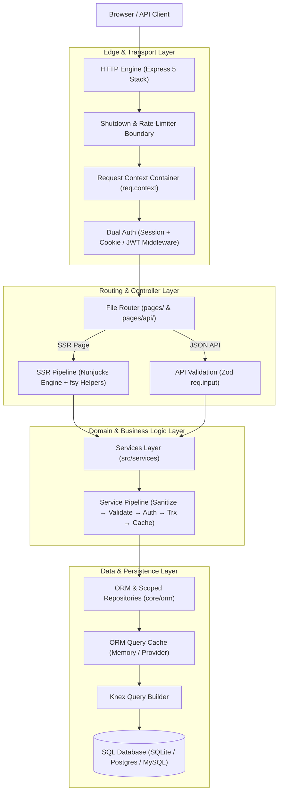

# System Architecture

> **Purpose:** Comprehensive mental model of the Webspresso runtime, layers, subsystem boundaries, and architectural principles.

---

## 1. Architectural Principles

Webspresso is designed around four core tenets:

1. **Zero-Dependency Sprawl**: Core runtime features (Dual Authentication, JWT signing, Error handling, Streaming Compression, Graceful Shutdown, and Template Helpers) rely strictly on Node.js built-ins (`crypto`, `path`, `fs`, `events`, `zlib`, `async_hooks`) without bloated npm dependency trees.
2. **File-Based Simplicity**: File structure explicitly reflects the application's URL routing (`pages/`), API endpoints (`pages/api/`), and domain business logic (`services/`).
3. **Ambient Context & Transactions**: Leveraging Node.js `AsyncLocalStorage`, database transactions propagate seamlessly across nested services and repositories without manual parameter passing (`trx`).
4. **Isolated Layer Boundaries**: The HTTP server layer, business logic services, data repositories, and client admin panel are strictly separated with predictable interfaces.

---

## 2. Layered Architecture Overview

The system processes incoming web traffic through clearly defined horizontal layers:

---

## 3. Subsystem Boundaries

### 3.1 HTTP Server & Transport (`src/server.js`)
- Mounts Express 5 with streaming zlib compression (`server.compression`), connection tracking, and graceful shutdown handlers.
- Instantiates Nunjucks with layout search paths, caching controls (`isDev`), and circular extension guards.
- Establishes `req.context` on every incoming request, attaching `req`, `res`, `db`, `app`, and `serviceRegistry`.

### 3.2 File-Based Router (`src/file-router.js`)
- Recursively scans `pages/` at process boot.
- Classifies routes into 4 deterministic registration tiers:
  1. Static literal paths (e.g. `/about`, `/users/new`)
  2. Nested dynamic paths (e.g. `/users/:id/settings`)
  3. Dynamic parameter paths (e.g. `/users/:id`)
  4. Catch-all wildcards (e.g. `/*`, `/docs/*`)
- Manages the SSR `load({ req, res, db, ctx })` data prefetching lifecycle and global/route lifecycle hooks (`onRequest`, `onRoute`, `beforeMiddleware`, `beforeRender`, `afterRender`, `onError`).

### 3.3 Services Layer (`src/services/`)
- Pure business logic layer decoupled from HTTP request objects.
- Automatically maps filesystem paths to dot-separated service names (`services/billing/invoice.js` → `'billing.invoice'`).
- Wraps handlers in declarative pipeline middleware: input sanitization against prototype pollution, Zod schema validation, auth role/predicate checks, automatic ACID transaction wrapping (`transaction: true`), and caching.

### 3.4 Knex ORM & Repositories (`core/orm/`)
- Provides schema builder (`zdb`) and declarative model definitions (`defineModel`).
- Automatically resolves ambient database transactions via `AsyncLocalStorage` (`core/orm/transaction.js`).
- Manages soft delete scopes, tenant filters, relation eager loading (`belongsTo`, `hasMany`, `hasOne`), and query complexity DoS protection.

### 3.5 Mithril.js Admin Panel SPA (`plugins/admin-panel/`)
- Standalone single-page CRUD application mounted at configurable admin prefix (default `/_admin`).
- Employs dedicated staff session isolation (`req.session.adminUser`) completely separated from public site authentication.
- Automatically wraps custom pages in admin layout and breadcrumbs, supporting custom field renderers, widgets, and bulk table actions.

---

## 4. Architectural Rules for Contributors

1. **No External Dependencies for Core Features**: Never introduce third-party npm packages for authentication, CORS, compression, shutdown, or errors.
2. **Ambient Transaction Propagation**: Repositories must bind to `getAmbientTransaction()` rather than expecting `trx` to be passed manually through every function argument.
3. **Isolated Component Separation**: Custom admin pages and client widgets must reside in standalone JavaScript files (`component.js`), never escaped inside inline template strings.
