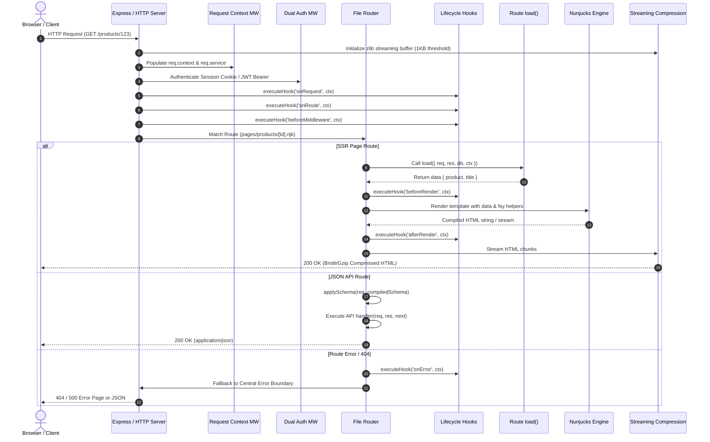

# Request Lifecycle

> **Purpose:** Detailed step-by-step trace of an incoming HTTP request through Webspresso's middleware pipeline, router, data loaders, template engine, and response stream.

---

## 1. Sequence Diagram

---

## 2. Step-by-Step Lifecycle Phases

### Phase 1: Transport & Connection Edge
1. **TCP Connection & Draining Check**: The server checks if it is in shutdown draining mode. If shutting down, new requests are rejected immediately with HTTP 503 (`Service Unavailable`).
2. **Streaming Compression (`server.compression`)**: The zero-dependency streaming zlib interceptor inspects the `Accept-Encoding` header (`br`, `gzip`, `deflate`). Payloads below the 1 KB threshold bypass compression; larger payloads stream through zlib transform streams.

### Phase 2: Context & Auth Initialization
3. **Request Context Container**:
   - `req.context` is initialized containing `{ req, res, db, app, serviceRegistry }`.
   - `req.service(name, input, opts)` is attached to allow calling business services directly from route handlers.
4. **Dual Authentication**:
   - For stateful web requests: `express-session` populates `req.session` and `req.user`.
   - For stateless API requests: The JWT middleware extracts `Authorization: Bearer <token>`, verifies the HMAC-SHA256 signature, and populates `req.auth`.

### Phase 3: Lifecycle Hooks & Route Resolution
5. **Global & Route Hooks**:
   - `onRequest(ctx)`: Invoked before route matching or middleware execution.
   - `onRoute(ctx)`: Invoked once the target route path is identified.
   - `beforeMiddleware(ctx)`: Invoked before executing page-specific middleware.
6. **Route Matching**:
   - Linear-time lookup matches the request URL against pre-sorted route tiers (static paths take precedence over dynamic `:id` segments, followed by catch-all `*`).

### Phase 4: Execution & Rendering
7. **SSR Data Prefetching (`load()`)**:
   - If the page exports an `async function load({ req, res, db, ctx })`, it executes server-side.
   - The returned data object is merged into the Nunjucks template context.
8. **Nunjucks Rendering**:
   - `beforeRender(ctx)` hook fires.
   - The template compiles with access to layout blocks, page assets (`pageAssets`), localized translator `t()`, and the `fsy` helper catalog (`fsy.asset`, `fsy.csrfToken`, `fsy.route`).
   - `afterRender(ctx)` hook fires.

### Phase 5: Error Boundary & Propagation
9. **Async Error Propagation**:
   - All async route methods and loaders are wrapped in auto-catch handlers. Rejections propagate to the central error boundary without requiring `try/catch` in every route.
   - In production (`NODE_ENV=production`), 500 error stack traces and internal diagnostics are masked for security.
