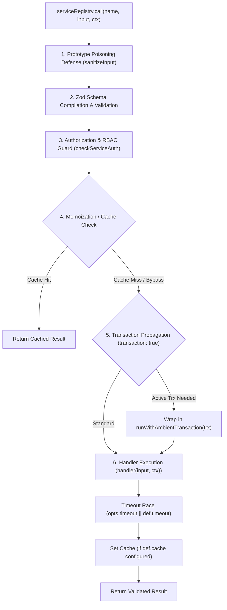

# Service Execution Pipeline

> **Purpose:** Deep dive into how Webspresso services validate input, enforce security guards, propagate database transactions, and execute business logic.

---

## 1. Pipeline Overview

When `ctx.service('order.create', input)` or `req.service('order.create', input)` is invoked, execution flows through a hardened, sequential 6-stage pipeline:



---

## 2. Pipeline Stages in Detail

### Stage 1: Prototype Pollution Defense
Before schema evaluation, the input payload passes through `core/validation/index.js: sanitizeInput()`. 
Any object containing dangerous prototype poisoning keys (`__proto__`, `constructor`, `prototype`) is recursively sanitized to prevent prototype pollution attacks.

### Stage 2: Declarative Zod Validation
The service definition schema can be specified in three flexible formats:
1. **Zod Schema**: `schema: z.object({ email: z.string().email(), amount: z.number().positive() })`
2. **Functional Compiler**: `schema: ({ z }) => z.object({ id: z.nanoid(), name: z.string() })`
3. **Type Descriptor Map**: `schema: { email: 'email', name: 'string', age: 'number?' }`

If validation fails, a structured `ValidationError` is thrown with an HTTP 422 mapping and detailed field-by-field error messages.

### Stage 3: Declarative Authorization & RBAC
The `auth` property in `defineService` enforces declarative access control:
- `auth: true` — Requires `ctx.user` or `ctx.req.user` to be authenticated.
- `auth: 'admin'` / `auth: ['admin', 'manager']` — Requires the user to have one of the specified roles (`user.role` or `user.roles`).
- `auth: (user, ctx) => boolean | Promise<boolean>` — Custom predicate function for dynamic authorization logic.

If authorization fails, a `SecurityError` (mapped to HTTP 403 Forbidden) is thrown immediately before executing the service handler.

### Stage 4: Service-Level Memoization & Caching
If `cache` is configured in `defineService`:
```javascript
cache: {
  ttl: '5m', // Cache for 5 minutes
  key: (input) => `user-profile:${input.userId}` // Dynamic cache key
}
```
The pipeline checks the in-memory/provider cache. On a cache hit, the cached result is returned immediately without invoking the handler or creating a database transaction.

### Stage 5: Ambient Transaction Wrapping (`transaction: true`)
When a service declares `transaction: true`:
- The pipeline checks if an ambient database transaction is already running in the current `AsyncLocalStorage` scope.
- If an active transaction exists (e.g. from an outer caller), the service seamlessly participates in the outer transaction without nested commit conflicts.
- If no active transaction exists, the pipeline opens a new Knex transaction and wraps execution in `runWithAmbientTransaction(trx, callback)`.
- If the service handler throws an unhandled error, the transaction automatically rolls back. On clean completion, it commits.

### Stage 6: Timeout Enforcement
Services can specify a maximum execution duration (e.g. `timeout: 5000` or `timeout: '5s'`).
The handler execution races against a timer. If the duration is exceeded, a `TimeoutError` is thrown, aborting the pending promise and triggering a transaction rollback.
