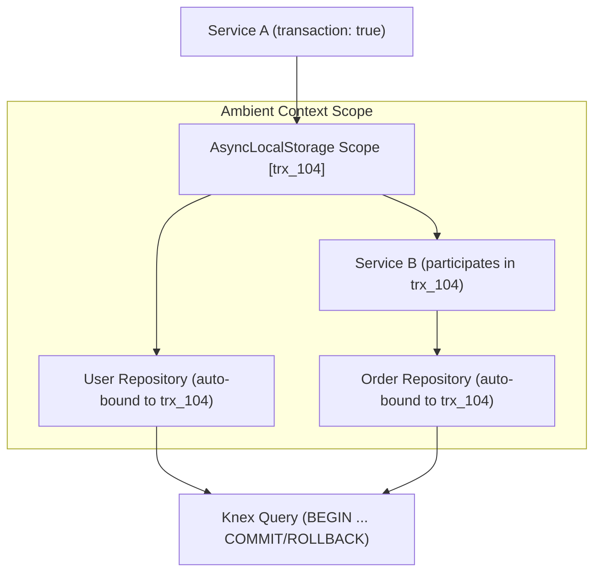

# Ambient Transaction Propagation

> **Purpose:** Understanding how Webspresso uses Node.js `AsyncLocalStorage` to automatically propagate ACID database transactions across services and ORM repositories without manual `trx` passing.

---

## 1. The Manual Transaction Problem

In traditional Node.js ORMs and query builders (like raw Knex), transactions require passing a transaction instance (`trx`) manually through every layer and function parameter:

```javascript
// ❌ Traditional manual approach: Error-prone and leaks database details
async function checkout(cartId, userId, trx) {
  const order = await createOrder(cartId, trx);
  await deductInventory(order.items, trx);
  await chargeCustomer(userId, order.total, trx);
}
```

If a developer forgets to pass `trx` to `deductInventory()`, that query executes outside the transaction, leading to partial writes, data corruption, and race conditions.

---

## 2. Webspresso Ambient Transaction Solution

Webspresso solves this with **Ambient Transactions** powered by Node.js native `AsyncLocalStorage` (`core/orm/transaction.js`).

When a transaction is started via `db.transaction()` or declarative `transaction: true` in a service:
1. The Knex transaction instance is bound to the current asynchronous execution context.
2. Any repository method (`userRepo.create()`, `orderRepo.update()`) or query builder call automatically detects and binds to the active transaction without explicit argument passing.



---

## 3. Usage Patterns

### Pattern A: Declarative Service Transactions (`transaction: true`)

The cleanest approach in business logic:

```javascript
const { defineService } = require('webspresso');

module.exports = defineService({
  transaction: true, // Automatically opens transaction and wraps execution

  async handler(input, ctx) {
    const userRepo = ctx.db.getRepository('User');
    const auditRepo = ctx.db.getRepository('AuditLog');

    // Both repository operations automatically use the same ACID transaction
    const user = await userRepo.create({ email: input.email, name: input.name });
    await auditRepo.create({ action: 'USER_CREATED', targetId: user.id });

    return user;
  },
});
```

### Pattern B: Programmatic `db.transaction()`

For procedural code or custom scripts:

```javascript
const { getDb } = require('webspresso');
const db = getDb();

const result = await db.transaction(async (trx) => {
  const userRepo = db.getRepository('User');
  const user = await userRepo.create({ name: 'Alice' });
  
  // Calling another service inside this block automatically inherits the transaction
  await req.service('notifications.send-welcome', { userId: user.id });
  
  return user;
});
```

---

## 4. Transaction Isolation & Error Handling

- **Automatic Rollback**: If any error or promise rejection occurs inside a transactional service or `db.transaction()` block, the active transaction is rolled back immediately before rethrowing the exception.
- **Outer Scope Participation**: If a service with `transaction: true` is called from inside an existing transaction, it reuses the outer transaction instead of opening an incompatible nested transaction.
